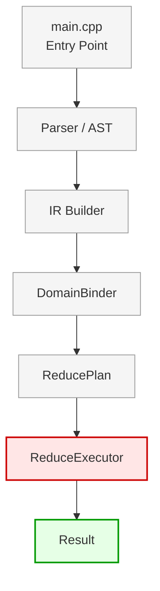

```mermaid
flowchart TD
    A[main.cpp<br/>Entry Point] --> B[Parser / AST]
    B --> C[IR Builder]
    C --> D[DomainBinder]
    D --> E[ReducePlan]
    E --> F[ReduceExecutor]
    F --> G[Result]

    style A fill:#f5f5f5,stroke:#999
    style B fill:#f5f5f5,stroke:#999
    style C fill:#f5f5f5,stroke:#999
    style D fill:#f5f5f5,stroke:#999
    style E fill:#f5f5f5,stroke:#999

    style F fill:#ffe6e6,stroke:#cc0000,stroke-width:2px
    style G fill:#e6ffe6,stroke:#009900,stroke-width:2px

```