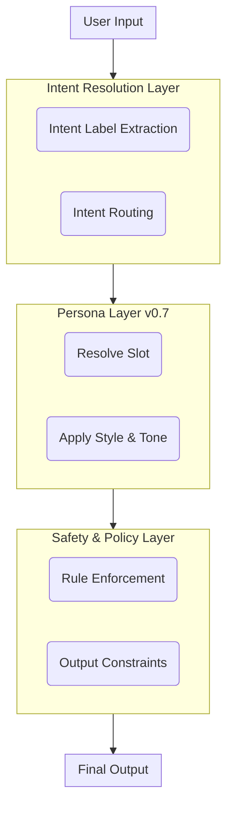

```mermaid
flowchart TB
    subgraph UserInput[User Input]
    end

    subgraph IR[Intent Resolution Layer]
        A1(Intent Label Extraction)
        A2(Intent Routing)
    end

    subgraph Persona[Persona Layer v0.7]
        P1(Resolve Slot)
        P2(Apply Style & Tone)
    end

    subgraph Safety[Safety & Policy Layer]
        S1(Rule Enforcement)
        S2(Output Constraints)
    end

    subgraph Output[Final Output]
    end

    UserInput --> IR
    IR --> Persona
    Persona --> Safety
    Safety --> Output

```