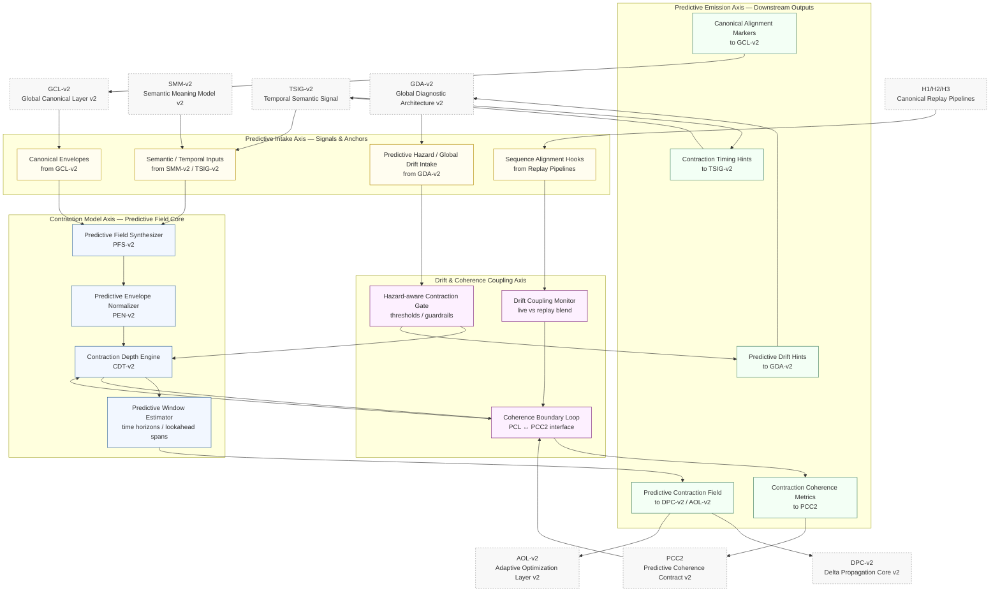

```mermaid
graph TB

  %% =========================
  %% 外部コンポーネント
  %% =========================
  SMM["SMM-v2<br/>Semantic Meaning Model v2"]
  TSIG["TSIG-v2<br/>Temporal Semantic Signal"]
  GDA["GDA-v2<br/>Global Diagnostic Architecture v2"]
  PCC2["PCC2<br/>Predictive Coherence Contract v2"]
  GCL["GCL-v2<br/>Global Canonical Layer v2"]
  DPC["DPC-v2<br/>Delta Propagation Core v2"]
  AOL["AOL-v2<br/>Adaptive Optimization Layer v2"]
  REPLAY["H1/H2/H3<br/>Canonical Replay Pipelines"]

  %% =========================
  %% クラスタ1: Predictive Intake Axis
  %% =========================
  subgraph PCL1["Predictive Intake Axis — Signals & Anchors"]
    IN_SEM["Semantic / Temporal Inputs<br/>from SMM-v2 / TSIG-v2"]
    IN_HAZ["Predictive Hazard / Global Drift Intake<br/>from GDA-v2"]
    IN_REPLAY["Sequence Alignment Hooks<br/>from Replay Pipelines"]
    IN_CANON["Canonical Envelopes<br/>from GCL-v2"]
  end

  %% =========================
  %% クラスタ2: Contraction Model Axis
  %% =========================
  subgraph PCL2["Contraction Model Axis — Predictive Field Core"]
    PFS["Predictive Field Synthesizer<br/>PFS-v2"]
    PEN["Predictive Envelope Normalizer<br/>PEN-v2"]
    CDT["Contraction Depth Engine<br/>CDT-v2"]
    PWE["Predictive Window Estimator<br/>time horizons / lookahead spans"]
  end

  %% =========================
  %% クラスタ3: Drift & Coherence Coupling Axis
  %% =========================
  subgraph PCL3["Drift & Coherence Coupling Axis"]
    DRIFT_MON["Drift Coupling Monitor<br/>live vs replay blend"]
    COH_LOOP["Coherence Boundary Loop<br/>PCL ↔ PCC2 interface"]
    HAZ_GATE["Hazard-aware Contraction Gate<br/>thresholds / guardrails"]
  end

  %% =========================
  %% クラスタ4: Predictive Emission Axis
  %% =========================
  subgraph PCL4["Predictive Emission Axis — Downstream Outputs"]
    OUT_FIELD["Predictive Contraction Field<br/>to DPC-v2 / AOL-v2"]
    OUT_PCC2["Contraction Coherence Metrics<br/>to PCC2"]
    OUT_GDA["Predictive Drift Hints<br/>to GDA-v2"]
    OUT_TSIG["Contraction Timing Hints<br/>to TSIG-v2"]
    OUT_GCL["Canonical Alignment Markers<br/>to GCL-v2"]
  end

  %% =========================
  %% 内部フロー: Intake → Model → Coupling → Emission
  %% =========================
  IN_SEM --> PFS
  IN_CANON --> PFS
  PFS --> PEN --> CDT --> PWE --> OUT_FIELD

  IN_REPLAY --> DRIFT_MON --> COH_LOOP
  IN_HAZ --> HAZ_GATE

  HAZ_GATE --> CDT
  HAZ_GATE --> OUT_GDA

  COH_LOOP --> CDT
  CDT --> COH_LOOP

  %% =========================
  %% 外部との接続（欠落点の明示再構成）
  %% ① GDA → PCL（予兆ハザード / グローバルドリフト）
  %% =========================
  GDA --> IN_HAZ
  OUT_GDA --> GDA

  %% ② PCC2 ↔ PCL（双方向収束境界ループ）
  PCC2 --> COH_LOOP
  COH_LOOP --> OUT_PCC2
  OUT_PCC2 --> PCC2

  %% ③ Replay → PCL（シーケンス同期 / drift coupling）
  REPLAY --> IN_REPLAY

  %% その他の連携
  SMM --> IN_SEM
  TSIG --> IN_SEM
  TSIG --> OUT_TSIG
  OUT_TSIG --> TSIG

  GCL --> IN_CANON
  OUT_GCL --> GCL

  OUT_FIELD --> DPC
  OUT_FIELD --> AOL

  %% =========================
  %% クラス定義 — 「=」禁止・コロン指定
  %% =========================
  classDef axis_in fill:#fffdf0,stroke:#b38b00,stroke-width:1px;
  classDef axis_model fill:#f2f7ff,stroke:#336699,stroke-width:1px;
  classDef axis_couple fill:#fdf0ff,stroke:#7a1f7a,stroke-width:1px;
  classDef axis_out fill:#f3fff5,stroke:#3f7f5f,stroke-width:1px;
  classDef ext fill:#f8f8f8,stroke:#999999,stroke-width:1px,stroke-dasharray:3 3;

  class IN_SEM,IN_HAZ,IN_REPLAY,IN_CANON axis_in;
  class PFS,PEN,CDT,PWE axis_model;
  class DRIFT_MON,COH_LOOP,HAZ_GATE axis_couple;
  class OUT_FIELD,OUT_PCC2,OUT_GDA,OUT_TSIG,OUT_GCL axis_out;

  class SMM,TSIG,GDA,PCC2,GCL,DPC,AOL,REPLAY ext;


```