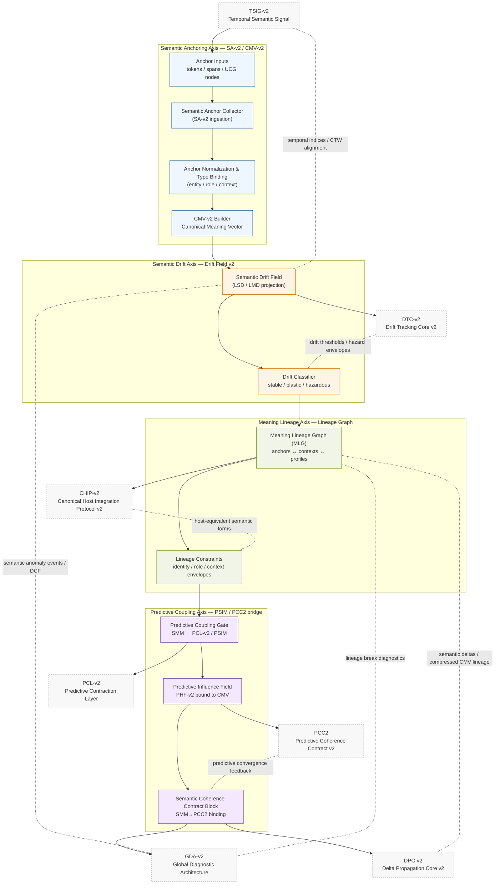

```mermaid
graph TB

  %% =========================
  %% 外部インターフェース（他コンポーネント）
  %% =========================
  TSIG["TSIG-v2<br/>Temporal Semantic Signal"]
  PCL["PCL-v2<br/>Predictive Contraction Layer"]
  PCC2["PCC2<br/>Predictive Coherence Contract v2"]
  GDA["GDA-v2<br/>Global Diagnostic Architecture"]
  DTC["DTC-v2<br/>Drift Tracking Core v2"]
  CHIP["CHIP-v2<br/>Canonical Host Integration Protocol v2"]
  DPC["DPC-v2<br/>Delta Propagation Core v2"]

  %% =========================
  %% クラスタ 1: Semantic Anchoring
  %% =========================
  subgraph SMM1["Semantic Anchoring Axis — SA-v2 / CMV-v2"]
    SA_IN["Anchor Inputs<br/>tokens / spans / UCG nodes"]
    SA_COLLECT["Semantic Anchor Collector<br/>(SA-v2 ingestion)"]
    SA_NORM["Anchor Normalization & Type Binding<br/>(entity / role / context)"]
    CMV_BUILD["CMV-v2 Builder<br/>Canonical Meaning Vector"]
  end

  %% =========================
  %% クラスタ 2: Semantic Drift
  %% =========================
  subgraph SMM2["Semantic Drift Axis — Drift Field v2"]
    DRIFT_FIELD["Semantic Drift Field<br/>(LSD / LMD projection)"]
    DRIFT_CLASS["Drift Classifier<br/>stable / plastic / hazardous"]
  end

  %% =========================
  %% クラスタ 3: Meaning-Lineage
  %% =========================
  subgraph SMM3["Meaning Lineage Axis — Lineage Graph"]
    ML_GRAPH["Meaning Lineage Graph (MLG)<br/>anchors ↔ contexts ↔ profiles"]
    ML_RULES["Lineage Constraints<br/>identity / role / context envelopes"]
  end

  %% =========================
  %% クラスタ 4: Predictive Coupling & Coherence Contract
  %% =========================
  subgraph SMM4["Predictive Coupling Axis — PSIM / PCC2 bridge"]
    PC_GATE["Predictive Coupling Gate<br/>SMM ↔ PCL-v2 / PSIM"]
    PC_FIELD["Predictive Influence Field<br/>PHF-v2 bound to CMV"]
    SCC_PCC2["Semantic Coherence Contract Block<br/>SMM→PCC2 binding"]
  end

  %% =========================
  %% 内部フロー（Semantic Anchoring → Drift → Lineage → Predictive Coupling → Coherence）
  %% =========================
  SA_IN --> SA_COLLECT --> SA_NORM --> CMV_BUILD
  CMV_BUILD --> DRIFT_FIELD --> DRIFT_CLASS
  DRIFT_CLASS --> ML_GRAPH --> ML_RULES
  ML_RULES --> PC_GATE --> PC_FIELD --> SCC_PCC2

  %% =========================
  %% TSIG / 時間軸との結合
  %% =========================
  TSIG --> SA_IN
  TSIG -. temporal indices / CTW alignment .- DRIFT_FIELD

  %% =========================
  %% DTC / ドリフト系との結合
  %% =========================
  DRIFT_FIELD --> DTC
  DTC -. drift thresholds / hazard envelopes .- DRIFT_CLASS

  %% =========================
  %% CHIP / ホスト同型性との結合
  %% =========================
  ML_GRAPH --> CHIP
  CHIP -. host-equivalent semantic forms .- ML_RULES

  %% =========================
  %% PCL / PCC2 / 予測軸との結合
  %% =========================
  PC_GATE --> PCL
  PC_FIELD --> PCC2
  PCC2 -. predictive convergence feedback .- SCC_PCC2

  %% =========================
  %% GDA / DPC / 診断・デルタ系との結合
  %% =========================
  SCC_PCC2 --> GDA
  GDA -. semantic anomaly events / DCF .- DRIFT_FIELD
  GDA -. lineage break diagnostics .- ML_GRAPH

  SCC_PCC2 --> DPC
  DPC -. semantic deltas / compressed CMV lineage .- ML_GRAPH

  %% =========================
  %% クラス定義（色付け） — 「=」禁止・コロン指定
  %% =========================
  classDef axis_semantic fill:#eef7ff,stroke:#336699,stroke-width:1px;
  classDef axis_drift fill:#fff4e6,stroke:#cc6600,stroke-width:1px;
  classDef axis_lineage fill:#f0f5e8,stroke:#668000,stroke-width:1px;
  classDef axis_predictive fill:#f3e8ff,stroke:#663399,stroke-width:1px;
  classDef ext_component fill:#f8f8f8,stroke:#999999,stroke-width:1px,stroke-dasharray:3 3;

  class SA_IN,SA_COLLECT,SA_NORM,CMV_BUILD axis_semantic;
  class DRIFT_FIELD,DRIFT_CLASS axis_drift;
  class ML_GRAPH,ML_RULES axis_lineage;
  class PC_GATE,PC_FIELD,SCC_PCC2 axis_predictive;

  class TSIG,PCL,PCC2,GDA,DTC,CHIP,DPC ext_component;


```