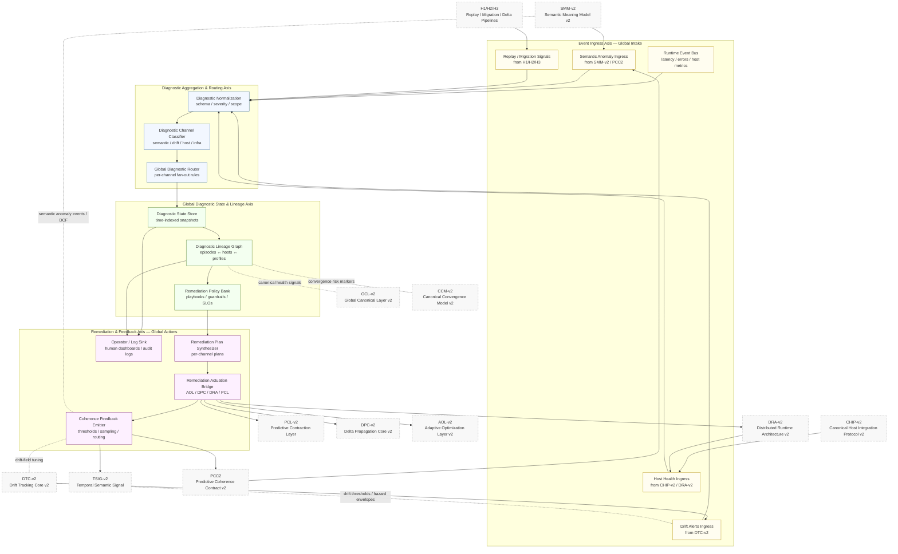

```mermaid
graph TB

  %% =========================
  %% 外部コンポーネント
  %% =========================
  TSIG["TSIG-v2<br/>Temporal Semantic Signal"]
  SMM["SMM-v2<br/>Semantic Meaning Model v2"]
  PCL["PCL-v2<br/>Predictive Contraction Layer"]
  PCC2["PCC2<br/>Predictive Coherence Contract v2"]
  DTC["DTC-v2<br/>Drift Tracking Core v2"]
  CHIP["CHIP-v2<br/>Canonical Host Integration Protocol v2"]
  DPC["DPC-v2<br/>Delta Propagation Core v2"]
  AOL["AOL-v2<br/>Adaptive Optimization Layer v2"]
  DRA["DRA-v2<br/>Distributed Runtime Architecture v2"]
  GCL["GCL-v2<br/>Global Canonical Layer v2"]
  CCM["CCM-v2<br/>Canonical Convergence Model v2"]
  H1["H1/H2/H3<br/>Replay / Migration / Delta Pipelines"]

  %% =========================
  %% クラスタ1: Event Ingress Axis
  %% =========================
  subgraph GDA1["Event Ingress Axis — Global Intake"]
    EV_BUS["Runtime Event Bus<br/>latency / errors / host metrics"]
    EV_SEM["Semantic Anomaly Ingress<br/>from SMM-v2 / PCC2"]
    EV_DRIFT["Drift Alerts Ingress<br/>from DTC-v2"]
    EV_HOST["Host Health Ingress<br/>from CHIP-v2 / DRA-v2"]
    EV_REPLAY["Replay / Migration Signals<br/>from H1/H2/H3"]
  end

  %% =========================
  %% クラスタ2: Diagnostic Aggregation & Routing Axis
  %% =========================
  subgraph GDA2["Diagnostic Aggregation & Routing Axis"]
    DIAG_NORM["Diagnostic Normalization<br/>schema / severity / scope"]
    DIAG_CLASS["Diagnostic Channel Classifier<br/>semantic / drift / host / infra"]
    DIAG_ROUTE["Global Diagnostic Router<br/>per-channel fan-out rules"]
  end

  %% =========================
  %% クラスタ3: Global Diagnostic State & Lineage Axis
  %% =========================
  subgraph GDA3["Global Diagnostic State & Lineage Axis"]
    DIAG_STORE["Diagnostic State Store<br/>time-indexed snapshots"]
    DIAG_LINEAGE["Diagnostic Lineage Graph<br/>episodes ↔ hosts ↔ profiles"]
    DIAG_POLICY["Remediation Policy Bank<br/>playbooks / guardrails / SLOs"]
  end

  %% =========================
  %% クラスタ4: Remediation & Feedback Axis
  %% =========================
  subgraph GDA4["Remediation & Feedback Axis — Global Actions"]
    REM_PLAN["Remediation Plan Synthesizer<br/>per-channel plans"]
    REM_ACT["Remediation Actuation Bridge<br/>AOL / DPC / DRA / PCL"]
    REM_FEEDBACK["Coherence Feedback Emitter<br/>thresholds / sampling / routing"]
    OBS_SINK["Operator / Log Sink<br/>human dashboards / audit logs"]
  end

  %% =========================
  %% 内部フロー: Ingress → Aggregation → State → Remediation
  %% =========================
  EV_BUS --> DIAG_NORM
  EV_SEM --> DIAG_NORM
  EV_DRIFT --> DIAG_NORM
  EV_HOST --> DIAG_NORM
  EV_REPLAY --> DIAG_NORM

  DIAG_NORM --> DIAG_CLASS --> DIAG_ROUTE
  DIAG_ROUTE --> DIAG_STORE --> DIAG_LINEAGE --> DIAG_POLICY
  DIAG_POLICY --> REM_PLAN --> REM_ACT --> REM_FEEDBACK
  DIAG_STORE --> OBS_SINK
  DIAG_LINEAGE --> OBS_SINK

  %% =========================
  %% SMM / PCC2 / DTC / CHIP / DPC との結合（SMM-v2 図との整合）
  %% =========================
  SMM --> EV_SEM
  PCC2 --> EV_SEM

  DTC --> EV_DRIFT
  EV_DRIFT -. drift thresholds / hazard envelopes .- DTC

  CHIP --> EV_HOST
  DRA --> EV_HOST

  H1 --> EV_REPLAY

  %% SMM側へのフィードバック（ドリフト場・系譜）
  REM_FEEDBACK -. semantic anomaly events / DCF .- SMM
  REM_FEEDBACK -. drift-field tuning .- DTC

  %% =========================
  %% PCL / PCC2 / AOL / DRA / DPC / GCL / CCM への出力
  %% =========================
  REM_ACT --> AOL
  REM_ACT --> DRA
  REM_ACT --> PCL
  REM_ACT --> DPC

  REM_FEEDBACK --> PCC2
  REM_FEEDBACK --> TSIG

  %% Canonical層への反映
  DIAG_LINEAGE -. canonical health signals .- GCL
  DIAG_LINEAGE -. convergence risk markers .- CCM

  %% =========================
  %% クラス定義（色付け） — 「=」禁止・コロン指定
  %% =========================
  classDef axis_ingress fill:#fffdf0,stroke:#b38b00,stroke-width:1px;
  classDef axis_agg fill:#f2f7ff,stroke:#336699,stroke-width:1px;
  classDef axis_state fill:#f3fff0,stroke:#4c7a1f,stroke-width:1px;
  classDef axis_output fill:#fdf0ff,stroke:#7a1f7a,stroke-width:1px;
  classDef ext_component fill:#f8f8f8,stroke:#999999,stroke-width:1px,stroke-dasharray:3 3;

  class EV_BUS,EV_SEM,EV_DRIFT,EV_HOST,EV_REPLAY axis_ingress;
  class DIAG_NORM,DIAG_CLASS,DIAG_ROUTE axis_agg;
  class DIAG_STORE,DIAG_LINEAGE,DIAG_POLICY axis_state;
  class REM_PLAN,REM_ACT,REM_FEEDBACK,OBS_SINK axis_output;

  class TSIG,SMM,PCL,PCC2,DTC,CHIP,DPC,AOL,DRA,GCL,CCM,H1 ext_component;


```