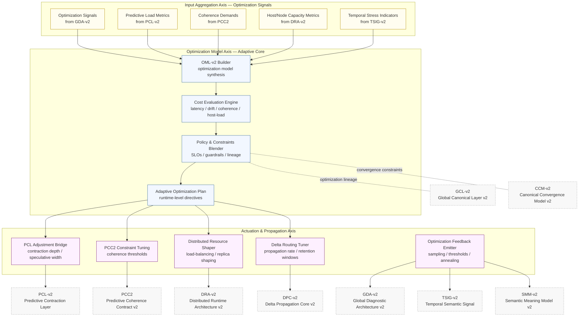

```mermaid
graph TB

  %% =========================
  %% 外部コンポーネント
  %% =========================
  GDA["GDA-v2<br/>Global Diagnostic Architecture v2"]
  PCL["PCL-v2<br/>Predictive Contraction Layer"]
  PCC2["PCC2<br/>Predictive Coherence Contract v2"]
  DPC["DPC-v2<br/>Delta Propagation Core v2"]
  DRA["DRA-v2<br/>Distributed Runtime Architecture v2"]
  SMM["SMM-v2<br/>Semantic Meaning Model v2"]
  TSIG["TSIG-v2<br/>Temporal Semantic Signal"]
  GCL["GCL-v2<br/>Global Canonical Layer v2"]
  CCM["CCM-v2<br/>Canonical Convergence Model v2"]

  %% =========================
  %% クラスタ 1: Input Aggregation Axis
  %% =========================
  subgraph AOL1["Input Aggregation Axis — Optimization Signals"]
    OPT_GDA["Optimization Signals<br/>from GDA-v2"]
    OPT_PCL["Predictive Load Metrics<br/>from PCL-v2"]
    OPT_PCC2["Coherence Demands<br/>from PCC2"]
    OPT_DRA["Host/Node Capacity Metrics<br/>from DRA-v2"]
    OPT_TSIG["Temporal Stress Indicators<br/>from TSIG-v2"]
  end

  %% =========================
  %% クラスタ 2: Optimization Model Axis
  %% =========================
  subgraph AOL2["Optimization Model Axis — Adaptive Core"]
    OML_BUILD["OML-v2 Builder<br/>optimization model synthesis"]
    COST_EVAL["Cost Evaluation Engine<br/>latency / drift / coherence / host-load"]
    POLICY_BLEND["Policy & Constraints Blender<br/>SLOs / guardrails / lineage"]
    OPT_PLAN["Adaptive Optimization Plan<br/>runtime-level directives"]
  end

  %% =========================
  %% クラスタ 3: Actuation & Propagation Axis
  %% =========================
  subgraph AOL3["Actuation & Propagation Axis"]
    ACT_PCL["PCL Adjustment Bridge<br/>contraction depth / speculative width"]
    ACT_PCC2["PCC2 Constraint Tuning<br/>coherence thresholds"]
    ACT_DRA["Distributed Resource Shaper<br/>load-balancing / replica shaping"]
    ACT_DPC["Delta Routing Tuner<br/>propagation rate / retention windows"]
    ACT_FEEDBACK["Optimization Feedback Emitter<br/>sampling / thresholds / annealing"]
  end

  %% =========================
  %% 入力結合
  %% =========================
  OPT_GDA --> OML_BUILD
  OPT_PCL --> OML_BUILD
  OPT_PCC2 --> OML_BUILD
  OPT_DRA --> OML_BUILD
  OPT_TSIG --> OML_BUILD

  OML_BUILD --> COST_EVAL --> POLICY_BLEND --> OPT_PLAN

  %% =========================
  %% Actuation: 各レイヤーへの最適化信号
  %% =========================
  OPT_PLAN --> ACT_PCL --> PCL
  OPT_PLAN --> ACT_PCC2 --> PCC2
  OPT_PLAN --> ACT_DRA --> DRA
  OPT_PLAN --> ACT_DPC --> DPC

  %% =========================
  %% Feedback Loops
  %% =========================
  ACT_FEEDBACK --> GDA
  ACT_FEEDBACK --> TSIG
  ACT_FEEDBACK --> SMM

  %% Canonical 層へ
  POLICY_BLEND -. optimization lineage .- GCL
  POLICY_BLEND -. convergence constraints .- CCM

  %% =========================
  %% クラス定義（色付け） — 「=」禁止・コロン指定
  %% =========================
  classDef axis_input fill:#fffdf0,stroke:#b38b00,stroke-width:1px;
  classDef axis_model fill:#f2f7ff,stroke:#336699,stroke-width:1px;
  classDef axis_act fill:#fdf0ff,stroke:#7a1f7a,stroke-width:1px;
  classDef ext_component fill:#f8f8f8,stroke:#999999,stroke-width:1px,stroke-dasharray:3 3;

  class OPT_GDA,OPT_PCL,OPT_PCC2,OPT_DRA,OPT_TSIG axis_input;
  class OML_BUILD,COST_EVAL,POLICY_BLEND,OPT_PLAN axis_model;
  class ACT_PCL,ACT_PCC2,ACT_DRA,ACT_DPC,ACT_FEEDBACK axis_act;

  class GDA,PCL,PCC2,DPC,DRA,SMM,TSIG,GCL,CCM ext_component;


```