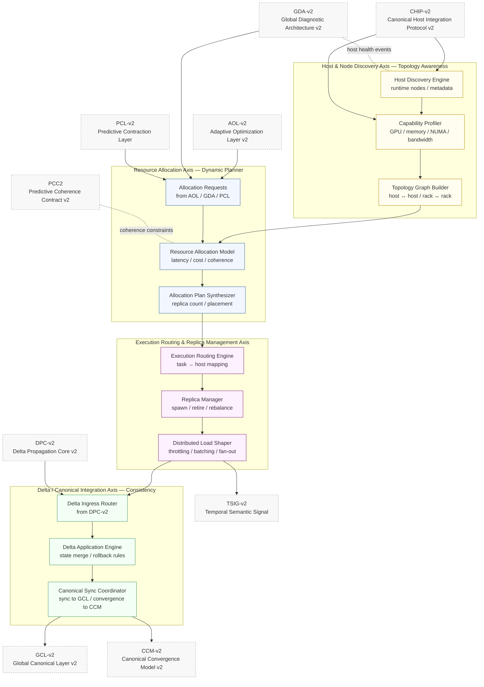

```mermaid
graph TB

  %% =========================
  %% 外部コンポーネント
  %% =========================
  GDA["GDA-v2<br/>Global Diagnostic Architecture v2"]
  AOL["AOL-v2<br/>Adaptive Optimization Layer v2"]
  CHIP["CHIP-v2<br/>Canonical Host Integration Protocol v2"]
  DPC["DPC-v2<br/>Delta Propagation Core v2"]
  PCL["PCL-v2<br/>Predictive Contraction Layer"]
  PCC2["PCC2<br/>Predictive Coherence Contract v2"]
  GCL["GCL-v2<br/>Global Canonical Layer v2"]
  CCM["CCM-v2<br/>Canonical Convergence Model v2"]
  TSIG["TSIG-v2<br/>Temporal Semantic Signal"]

  %% =========================
  %% クラスタ1: Host & Node Discovery Axis
  %% =========================
  subgraph DRA1["Host & Node Discovery Axis — Topology Awareness"]
    DISC_HOSTS["Host Discovery Engine<br/>runtime nodes / metadata"]
    DISC_CAP["Capability Profiler<br/>GPU / memory / NUMA / bandwidth"]
    TOPO_BUILD["Topology Graph Builder<br/>host ↔ host / rack ↔ rack"]
  end

  %% =========================
  %% クラスタ2: Resource Allocation Axis
  %% =========================
  subgraph DRA2["Resource Allocation Axis — Dynamic Planner"]
    RALLOC_REQ["Allocation Requests<br/>from AOL / GDA / PCL"]
    RALLOC_MODEL["Resource Allocation Model<br/>latency / cost / coherence"]
    RALLOC_PLAN["Allocation Plan Synthesizer<br/>replica count / placement"]
  end

  %% =========================
  %% クラスタ3: Execution Routing & Replica Management Axis
  %% =========================
  subgraph DRA3["Execution Routing & Replica Management Axis"]
    ROUTE_ENGINE["Execution Routing Engine<br/>task → host mapping"]
    REPL_MANAGER["Replica Manager<br/>spawn / retire / rebalance"]
    LOAD_SHAPER["Distributed Load Shaper<br/>throttling / batching / fan-out"]
  end

  %% =========================
  %% クラスタ4: Delta / Canonical Integration Axis
  %% =========================
  subgraph DRA4["Delta / Canonical Integration Axis — Consistency"]
    DELTA_INGRESS["Delta Ingress Router<br/>from DPC-v2"]
    DELTA_APPLY["Delta Application Engine<br/>state merge / rollback rules"]
    CANON_SYNC["Canonical Sync Coordinator<br/>sync to GCL / convergence to CCM"]
  end

  %% =========================
  %% 内部フロー: Discovery → Allocation → Routing → Canonical Sync
  %% =========================
  DISC_HOSTS --> DISC_CAP --> TOPO_BUILD

  TOPO_BUILD --> RALLOC_MODEL
  RALLOC_REQ --> RALLOC_MODEL --> RALLOC_PLAN

  RALLOC_PLAN --> ROUTE_ENGINE --> REPL_MANAGER --> LOAD_SHAPER

  LOAD_SHAPER --> DELTA_INGRESS --> DELTA_APPLY --> CANON_SYNC

  %% =========================
  %% 外部との接続
  %% =========================
  AOL --> RALLOC_REQ
  GDA --> RALLOC_REQ

  PCL --> RALLOC_REQ
  PCC2 -. coherence constraints .- RALLOC_MODEL

  CHIP --> DISC_HOSTS
  CHIP --> DISC_CAP

  DPC --> DELTA_INGRESS

  CANON_SYNC --> GCL
  CANON_SYNC --> CCM

  LOAD_SHAPER --> TSIG

  GDA -. host health events .- DISC_HOSTS

  %% =========================
  %% クラス定義 — 「=」禁止・コロン指定
  %% =========================
  classDef axis_disc fill:#fffdf0,stroke:#b38b00,stroke-width:1px;
  classDef axis_alloc fill:#f2f7ff,stroke:#336699,stroke-width:1px;
  classDef axis_route fill:#fdf0ff,stroke:#7a1f7a,stroke-width:1px;
  classDef axis_delta fill:#f3fff5,stroke:#3f8f5f,stroke-width:1px;
  classDef ext fill:#f8f8f8,stroke:#999,stroke-width:1px,stroke-dasharray:3 3;

  class DISC_HOSTS,DISC_CAP,TOPO_BUILD axis_disc;
  class RALLOC_REQ,RALLOC_MODEL,RALLOC_PLAN axis_alloc;
  class ROUTE_ENGINE,REPL_MANAGER,LOAD_SHAPER axis_route;
  class DELTA_INGRESS,DELTA_APPLY,CANON_SYNC axis_delta;

  class GDA,AOL,CHIP,DPC,PCL,PCC2,GCL,CCM,TSIG ext;


```