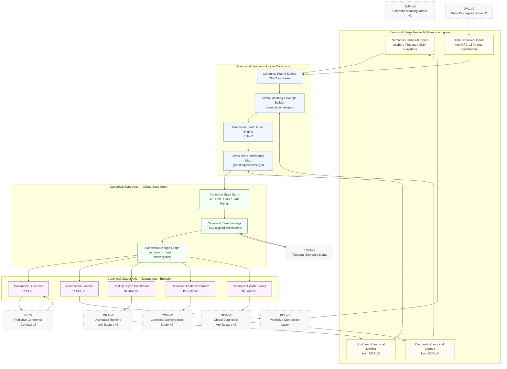

```mermaid
graph TB

  %% =========================
  %% 外部コンポーネント
  %% =========================
  SMM["SMM-v2<br/>Semantic Meaning Model v2"]
  PCL["PCL-v2<br/>Predictive Contraction Layer"]
  PCC2["PCC2<br/>Predictive Coherence Contract v2"]
  GDA["GDA-v2<br/>Global Diagnostic Architecture v2"]
  DPC["DPC-v2<br/>Delta Propagation Core v2"]
  DRA["DRA-v2<br/>Distributed Runtime Architecture v2"]
  CCM["CCM-v2<br/>Canonical Convergence Model v2"]
  TSIG["TSIG-v2<br/>Temporal Semantic Signal"]

  %% =========================
  %% クラスタ1: Canonical Intake Axis
  %% =========================
  subgraph GCL1["Canonical Intake Axis — Multi-source Ingress"]
    GCL_SEM_IN["Semantic Canonical Inputs<br/>anchors / lineage / CMV snapshots"]
    GCL_DELTA_IN["Delta Canonical Inputs<br/>from DPC-v2 (merge candidates)"]
    GCL_DIAG_IN["Diagnostic Canonical Signals<br/>from GDA-v2"]
    GCL_LOAD_IN["Host/Load Canonical Metrics<br/>from DRA-v2"]
  end

  %% =========================
  %% クラスタ2: Canonical Synthesis Axis
  %% =========================
  subgraph GCL2["Canonical Synthesis Axis — Core Logic"]
    CF_BUILD["Canonical Frame Builder<br/>CF-v2 synthesis"]
    GME_BUILD["Global Meaning Envelope Builder<br/>semantic envelopes"]
    CHI_COMPUTE["Canonical Health Index Engine<br/>CHI-v2"]
    CONSIST_MAP["Cross-host Consistency Map<br/>global equivalence grid"]
  end

  %% =========================
  %% クラスタ3: Canonical State Axis
  %% =========================
  subgraph GCL3["Canonical State Axis — Global State Store"]
    GCL_STORE["Canonical State Store<br/>CF / GME / CHI / Sync Points"]
    GCL_TIME["Canonical Time Bindings<br/>TSIG-aligned checkpoints"]
    GCL_LINEAGE["Canonical Lineage Graph<br/>semantic ↔ host ↔ convergence"]
  end

  %% =========================
  %% クラスタ4: Canonical Output Axis
  %% =========================
  subgraph GCL4["Canonical Output Axis — Downstream Emission"]
    OUT_PCC2["Coherence Directives<br/>to PCC2"]
    OUT_PCL["Contraction Factors<br/>to PCL-v2"]
    OUT_DRA["Replica / Sync Constraints<br/>to DRA-v2"]
    OUT_CCM["Canonical Evidence Stream<br/>to CCM-v2"]
    OUT_GDA["Canonical Health Events<br/>to GDA-v2"]
  end

  %% =========================
  %% Intake → Synthesis → State → Output
  %% =========================
  GCL_SEM_IN --> CF_BUILD
  GCL_DELTA_IN --> CF_BUILD
  GCL_DIAG_IN --> GME_BUILD
  GCL_LOAD_IN --> CONSIST_MAP

  CF_BUILD --> GME_BUILD --> CHI_COMPUTE --> CONSIST_MAP

  CONSIST_MAP --> GCL_STORE --> GCL_TIME --> GCL_LINEAGE

  GCL_LINEAGE --> OUT_PCC2
  GCL_LINEAGE --> OUT_PCL
  GCL_LINEAGE --> OUT_DRA
  GCL_LINEAGE --> OUT_CCM
  GCL_LINEAGE --> OUT_GDA

  %% =========================
  %% 外部連係
  %% =========================
  SMM --> GCL_SEM_IN
  PCL --> GCL_SEM_IN
  PCC2 --> OUT_PCC2

  DPC --> GCL_DELTA_IN
  GDA --> GCL_DIAG_IN
  DRA --> GCL_LOAD_IN

  OUT_PCL --> PCL
  OUT_PCC2 --> PCC2
  OUT_DRA --> DRA
  OUT_CCM --> CCM
  OUT_GDA --> GDA

  GCL_TIME --> TSIG
  TSIG --> GCL_TIME

  %% =========================
  %% クラス定義 — 「=」禁止・コロン指定
  %% =========================
  classDef axis_intake fill:#fffdf0,stroke:#b38b00,stroke-width:1px;
  classDef axis_syn fill:#f2f7ff,stroke:#336699,stroke-width:1px;
  classDef axis_state fill:#f3fff5,stroke:#3f7f5f,stroke-width:1px;
  classDef axis_out fill:#fdf0ff,stroke:#7a1f7a,stroke-width:1px;
  classDef ext fill:#f8f8f8,stroke:#999,stroke-width:1px,stroke-dasharray:3 3;

  class GCL_SEM_IN,GCL_DELTA_IN,GCL_DIAG_IN,GCL_LOAD_IN axis_intake;
  class CF_BUILD,GME_BUILD,CHI_COMPUTE,CONSIST_MAP axis_syn;
  class GCL_STORE,GCL_TIME,GCL_LINEAGE axis_state;
  class OUT_PCL,OUT_PCC2,OUT_DRA,OUT_CCM,OUT_GDA axis_out;

  class SMM,PCL,PCC2,GDA,DPC,DRA,CCM,TSIG ext;


```