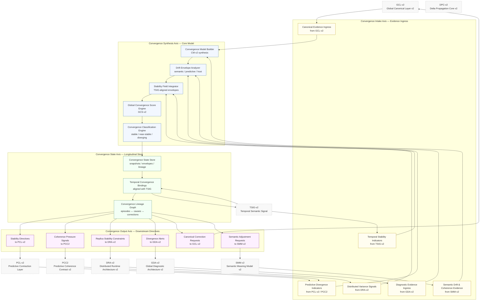

```mermaid
graph TB

  %% =========================
  %% 外部コンポーネント
  %% =========================
  GCL["GCL-v2<br/>Global Canonical Layer v2"]
  GDA["GDA-v2<br/>Global Diagnostic Architecture v2"]
  PCL["PCL-v2<br/>Predictive Contraction Layer"]
  PCC2["PCC2<br/>Predictive Coherence Contract v2"]
  DRA["DRA-v2<br/>Distributed Runtime Architecture v2"]
  SMM["SMM-v2<br/>Semantic Meaning Model v2"]
  TSIG["TSIG-v2<br/>Temporal Semantic Signal"]
  DPC["DPC-v2<br/>Delta Propagation Core v2"]

  %% =========================
  %% クラスタ1: Convergence Intake Axis
  %% =========================
  subgraph CCM1["Convergence Intake Axis — Evidence Ingress"]
    CIN_CANON["Canonical Evidence Ingress<br/>from GCL-v2"]
    CIN_DIAG["Diagnostic Evidence Ingress<br/>from GDA-v2"]
    CIN_PRED["Predictive Divergence Indicators<br/>from PCL-v2 / PCC2"]
    CIN_DIST["Distributed Variance Signals<br/>from DRA-v2"]
    CIN_SEM["Semantic Drift & Coherence Evidence<br/>from SMM-v2"]
    CIN_TIME["Temporal Stability Indicators<br/>from TSIG-v2"]
  end

  %% =========================
  %% クラスタ2: Convergence Synthesis Axis
  %% =========================
  subgraph CCM2["Convergence Synthesis Axis — Core Model"]
    C_MODEL["Convergence Model Builder<br/>CM-v2 synthesis"]
    C_DRIFT["Drift Envelope Analyzer<br/>semantic / predictive / host"]
    C_STAB["Stability Field Integrator<br/>TSIG-aligned envelopes"]
    C_SCORE["Global Convergence Score Engine<br/>GCS-v2"]
    C_CLASS["Convergence Classification Engine<br/>stable / near-stable / diverging"]
  end

  %% =========================
  %% クラスタ3: Convergence State Axis
  %% =========================
  subgraph CCM3["Convergence State Axis — Longitudinal Store"]
    C_STATE["Convergence State Store<br/>snapshots / envelopes / lineage"]
    C_TIME["Temporal Convergence Bindings<br/>aligned with TSIG"]
    C_LINEAGE["Convergence Lineage Graph<br/>episodes ↔ causes ↔ corrections"]
  end

  %% =========================
  %% クラスタ4: Convergence Output Axis
  %% =========================
  subgraph CCM4["Convergence Output Axis — Downstream Directives"]
    OUT_PCL["Stability Directives<br/>to PCL-v2"]
    OUT_PCC2["Coherence Pressure Signals<br/>to PCC2"]
    OUT_DRA["Replica Stability Constraints<br/>to DRA-v2"]
    OUT_GDA["Divergence Alerts<br/>to GDA-v2"]
    OUT_GCL["Canonical Correction Requests<br/>to GCL-v2"]
    OUT_SMM["Semantic Adjustment Requests<br/>to SMM-v2"]
  end

  %% =========================
  %% Intake → Synthesis → State → Output
  %% =========================
  CIN_CANON --> C_MODEL
  CIN_SEM --> C_MODEL
  CIN_PRED --> C_DRIFT
  CIN_DIAG --> C_DRIFT
  CIN_DIST --> C_STAB
  CIN_TIME --> C_STAB

  C_MODEL --> C_DRIFT --> C_STAB --> C_SCORE --> C_CLASS

  C_CLASS --> C_STATE --> C_TIME --> C_LINEAGE

  C_LINEAGE --> OUT_PCL
  C_LINEAGE --> OUT_PCC2
  C_LINEAGE --> OUT_DRA
  C_LINEAGE --> OUT_GDA
  C_LINEAGE --> OUT_GCL
  C_LINEAGE --> OUT_SMM

  %% =========================
  %% External connections
  %% =========================
  GCL --> CIN_CANON
  GDA --> CIN_DIAG
  PCL --> CIN_PRED
  PCC2 --> CIN_PRED
  DRA --> CIN_DIST
  SMM --> CIN_SEM
  TSIG --> CIN_TIME

  OUT_PCL --> PCL
  OUT_PCC2 --> PCC2
  OUT_DRA --> DRA
  OUT_GDA --> GDA
  OUT_GCL --> GCL
  OUT_SMM --> SMM

  C_TIME --> TSIG
  TSIG --> C_TIME

  %% =========================
  %% クラス定義 — 「=」禁止・コロン指定
  %% =========================
  classDef axis_in fill:#fffdf0,stroke:#b38b00,stroke-width:1px;
  classDef axis_syn fill:#f2f7ff,stroke:#336699,stroke-width:1px;
  classDef axis_state fill:#f3fff5,stroke:#3f7f5f,stroke-width:1px;
  classDef axis_out fill:#fdf0ff,stroke:#7a1f7a,stroke-width:1px;
  classDef ext fill:#f8f8f8,stroke:#999,stroke-width:1px,stroke-dasharray:3 3;

  class CIN_CANON,CIN_DIAG,CIN_PRED,CIN_DIST,CIN_SEM,CIN_TIME axis_in;
  class C_MODEL,C_DRIFT,C_STAB,C_SCORE,C_CLASS axis_syn;
  class C_STATE,C_TIME,C_LINEAGE axis_state;
  class OUT_PCL,OUT_PCC2,OUT_DRA,OUT_GDA,OUT_GCL,OUT_SMM axis_out;

  class GCL,GDA,PCL,PCC2,DRA,SMM,TSIG,DPC ext;


```