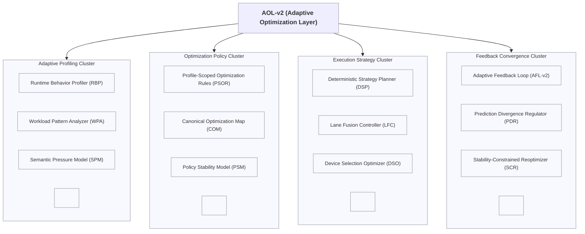

```mermaid
flowchart TB

    %% ============================
    %%  Class Definitions
    %% ============================
    classDef title fill:#eef,stroke:#99a,stroke-width:1px,font-size:16px,font-weight:bold;
    classDef box fill:#f8f8ff,stroke:#99a,stroke-width:1px,font-size:13px;


    %% ============================
    %%  Layer Title
    %% ============================
    AOLTitle["AOL-v2 (Adaptive Optimization Layer)"]
    class AOLTitle title


    %% ============================
    %%  Clusters
    %% ============================

    %% --- 1. Adaptive Profiling Cluster ---
    subgraph A1["Adaptive Profiling Cluster"]
        A1n1["Runtime Behavior Profiler (RBP)"]
        A1n2["Workload Pattern Analyzer (WPA)"]
        A1n3["Semantic Pressure Model (SPM)"]
        A1n4["&nbsp;"]
    end

    %% --- 2. Optimization Policy Cluster ---
    subgraph A2["Optimization Policy Cluster"]
        A2n1["Profile-Scoped Optimization Rules (PSOR)"]
        A2n2["Canonical Optimization Map (COM)"]
        A2n3["Policy Stability Model (PSM)"]
        A2n4["&nbsp;"]
    end

    %% --- 3. Execution Strategy Cluster ---
    subgraph A3["Execution Strategy Cluster"]
        A3n1["Deterministic Strategy Planner (DSP)"]
        A3n2["Lane Fusion Controller (LFC)"]
        A3n3["Device Selection Optimizer (DSO)"]
        A3n4["&nbsp;"]
    end

    %% --- 4. Feedback Convergence Cluster ---
    subgraph A4["Feedback Convergence Cluster"]
        A4n1["Adaptive Feedback Loop (AFL-v2)"]
        A4n2["Prediction Divergence Regulator (PDR)"]
        A4n3["Stability-Constrained Reoptimizer (SCR)"]
        A4n4["&nbsp;"]
    end


    %% ============================
    %%  Layout
    %% ============================
    AOLTitle --> A1
    AOLTitle --> A2
    AOLTitle --> A3
    AOLTitle --> A4

    class A1,A1n1,A1n2,A1n3,A1n4 box
    class A2,A2n1,A2n2,A2n3,A2n4 box
    class A3,A3n1,A3n2,A3n3,A3n4 box
    class A4,A4n1,A4n2,A4n3,A4n4 box

```