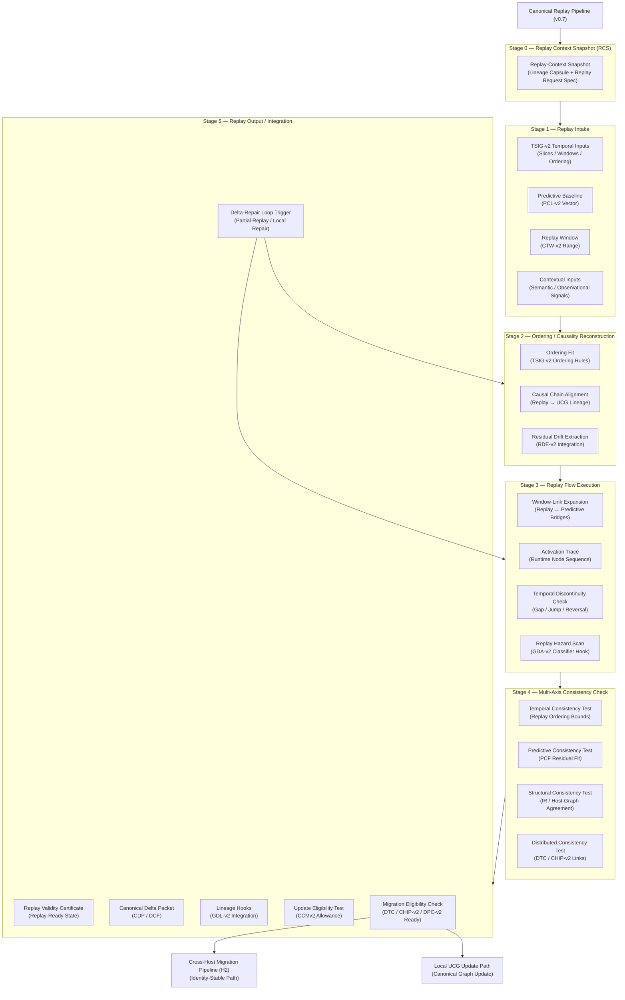

```mermaid
flowchart TB

%% ================================
%% Canonical Replay Pipeline (v0.7, Full Version)
%% ================================

R0["Canonical Replay Pipeline (v0.7)"]

%% -------------------------------
%% Stage 0 — Replay Context Snapshot (RCS)
%% -------------------------------
subgraph S0["Stage 0 — Replay Context Snapshot (RCS)"]
    S0A["Replay-Context Snapshot<br/>(Lineage Capsule + Replay Request Spec)"]
end

%% -------------------------------
%% Stage 1 — Replay Intake
%% -------------------------------
subgraph S1["Stage 1 — Replay Intake"]
    S1A["TSIG-v2 Temporal Inputs<br/>(Slices / Windows / Ordering)"]
    S1B["Predictive Baseline<br/>(PCL-v2 Vector)"]
    S1C["Replay Window<br/>(CTW-v2 Range)"]
    S1D["Contextual Inputs<br/>(Semantic / Observational Signals)"]
end

%% -------------------------------
%% Stage 2 — Ordering / Causality
%% -------------------------------
subgraph S2["Stage 2 — Ordering / Causality Reconstruction"]
    S2A["Ordering Fit<br/>(TSIG-v2 Ordering Rules)"]
    S2B["Causal Chain Alignment<br/>(Replay → UCG Lineage)"]
    S2C["Residual Drift Extraction<br/>(RDE-v2 Integration)"]
end

%% -------------------------------
%% Stage 3 — Replay Flow Execution
%% -------------------------------
subgraph S3["Stage 3 — Replay Flow Execution"]
    S3A["Window-Link Expansion<br/>(Replay ↔ Predictive Bridges)"]
    S3B["Activation Trace<br/>(Runtime Node Sequence)"]
    S3C["Temporal Discontinuity Check<br/>(Gap / Jump / Reversal)"]
    S3D["Replay Hazard Scan<br/>(GDA-v2 Classifier Hook)"]
end

%% -------------------------------
%% Stage 4 — Multi-Axis Verification
%% -------------------------------
subgraph S4["Stage 4 — Multi-Axis Consistency Check"]
    S4A["Temporal Consistency Test<br/>(Replay Ordering Bounds)"]
    S4B["Predictive Consistency Test<br/>(PCF Residual Fit)"]
    S4C["Structural Consistency Test<br/>(IR / Host-Graph Agreement)"]
    S4D["Distributed Consistency Test<br/>(DTC / CHIP-v2 Links)"]
end

%% -------------------------------
%% Stage 5 — Replay Output / Integration
%% -------------------------------
subgraph S5["Stage 5 — Replay Output / Integration"]
    S5A["Replay Validity Certificate<br/>(Replay-Ready State)"]
    S5B["Canonical Delta Packet<br/>(CDP / DCF)"]
    S5C["Lineage Hooks<br/>(GDL-v2 Integration)"]
    S5D["Update Eligibility Test<br/>(CCMv2 Allowance)"]
    S5E["Delta-Repair Loop Trigger<br/>(Partial Replay / Local Repair)"]
    S5F["Migration Eligibility Check<br/>(DTC / CHIP-v2 / DPC-v2 Ready)"]
end

%% -------------------------------
%% Migration / Local Update Targets
%% -------------------------------
M1["Cross-Host Migration Pipeline (H2)<br/>(Identity-Stable Path)"]
U1["Local UCG Update Path<br/>(Canonical Graph Update)"]

%% ----------- Main Flow -----------
R0 --> S0
S0 --> S1
S1 --> S2
S2 --> S3
S3 --> S4
S4 --> S5

%% ----------- Delta-Repair Loop -----------
S5E --> S2
S5E --> S3

%% ----------- Migration / Local Update Branch -----------
S5F --> M1
S5F --> U1


```