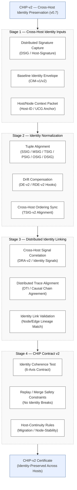

```mermaid
flowchart TB

%% =============================
%% Styles
%% =============================
classDef header fill:#e8f0ff,stroke:#4a6fa5,stroke-width:1px;
classDef cluster fill:#f9f9f9,stroke:#999,stroke-dasharray:3 3,color:#000;
classDef node fill:#ffffff,stroke:#555,stroke-width:1px;
classDef out fill:#e8f0ff,stroke:#4a6fa5,stroke-width:1px;

%% =============================
%% Header
%% =============================
CHIP["CHIP-v2 — Cross-Host Identity Preservation (v0.7)"]:::header

%% =============================
%% Stage 1 — Cross-Host Identity Inputs
%% =============================
subgraph C1["Stage 1 — Cross-Host Identity Inputs"]
    IH1["Distributed Signature Capture<br/>(DSIG / Host-Signature)"]:::node
    IH2["Baseline Identity Envelope<br/>(CIM-v1/v2)"]:::node
    IH3["Host/Node Context Packet<br/>(Host-ID / UCG Anchor)"]:::node
end
class C1 cluster;

%% =============================
%% Stage 2 — Identity Normalization
%% =============================
subgraph C2["Stage 2 — Identity Normalization"]
    IN1["Tuple Alignment<br/>(SSIG / MSIG / TSIG / PSIG / OSIG / DSIG)"]:::node
    IN2["Drift Compensation<br/>(DE-v2 / RDE-v2 Hooks)"]:::node
    IN3["Cross-Host Ordering Sync<br/>(TSIG-v2 Alignment)"]:::node
end
class C2 cluster;

%% =============================
%% Stage 3 — Distributed Identity Linking
%% =============================
subgraph C3["Stage 3 — Distributed Identity Linking"]
    IL1["Cross-Host Signal Correlation<br/>(DRA-v2 / Identity Signals)"]:::node
    IL2["Distributed Trace Alignment<br/>(DTI / Causal Chain Agreement)"]:::node
    IL3["Identity Link Validation<br/>(Node/Edge Lineage Match)"]:::node
end
class C3 cluster;

%% =============================
%% Stage 4 — CHIP Contract v2
%% =============================
subgraph C4["Stage 4 — CHIP Contract v2"]
    IC1["Identity Coherence Test<br/>(6-Axis Contract)"]:::node
    IC2["Replay / Merge Safety Constraints<br/>(No Identity Breaks)"]:::node
    IC3["Host-Continuity Rules<br/>(Migration / Node-Stability)"]:::node
end
class C4 cluster;

%% =============================
%% Output
%% =============================
CERT["CHIP-v2 Certificate<br/>(Identity-Preserved Across Hosts)"]:::out

%% =============================
%% Flow
%% =============================
CHIP --> C1
C1 --> C2
C2 --> C3
C3 --> C4
C4 --> CERT


```