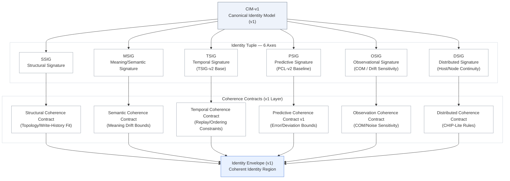

```mermaid
graph TB

%% ===========================
%% White Theme Styles
%% ===========================
classDef cluster fill:#ffffff,stroke:#d0d7df,stroke-width:1px;
classDef core fill:#eef3fb,stroke:#7a8695,stroke-width:1.2px;
classDef node fill:#ffffff,stroke:#7a8695,stroke-width:0.8px;
classDef io fill:#e8f1ff,stroke:#4b7bd9,stroke-width:1px;

%% ===========================
%% CIM-v1 Core
%% ===========================
CIM_CORE["CIM-v1<br/>Canonical Identity Model (v1)"]
class CIM_CORE core;

%% ===========================
%% Six-Axis Identity Tuple
%% ===========================
subgraph AXES["Identity Tuple — 6 Axes"]
direction TB

AX_SSIG["SSIG<br/>Structural Signature"]
AX_MSIG["MSIG<br/>Meaning/Semantic Signature"]
AX_TSIG["TSIG<br/>Temporal Signature<br/>(TSIG-v2 Base)"]
AX_PSIG["PSIG<br/>Predictive Signature<br/>(PCL-v2 Baseline)"]
AX_OSIG["OSIG<br/>Observational Signature<br/>(COM / Drift Sensitivity)"]
AX_DSIG["DSIG<br/>Distributed Signature<br/>(Host/Node Continuity)"]

class AX_SSIG,AX_MSIG,AX_TSIG,AX_PSIG,AX_OSIG,AX_DSIG node;
end
class AXES cluster;

%% ===========================
%% Coherence Contracts
%% ===========================
subgraph CONTRACTS["Coherence Contracts (v1 Layer)"]
direction TB

CC_STRUCT["Structural Coherence Contract<br/>(Topology/Write-History Fit)"]
CC_SEM["Semantic Coherence Contract<br/>(Meaning Drift Bounds)"]
CC_TIME["Temporal Coherence Contract<br/>(Replay/Ordering Constraints)"]
CC_PRED["Predictive Coherence Contract v1<br/>(Error/Deviation Bounds)"]
CC_OBS["Observation Coherence Contract<br/>(COM/Noise Sensitivity)"]
CC_DIST["Distributed Coherence Contract<br/>(CHIP-Lite Rules)"]

class CC_STRUCT,CC_SEM,CC_TIME,CC_PRED,CC_OBS,CC_DIST node;
end
class CONTRACTS cluster;

%% ===========================
%% Identity Envelope
%% ===========================
ID_ENV["Identity Envelope (v1)<br/>Coherent Identity Region"]
class ID_ENV io;

%% ===========================
%% Wiring
%% ===========================
CIM_CORE --> AX_SSIG
CIM_CORE --> AX_MSIG
CIM_CORE --> AX_TSIG
CIM_CORE --> AX_PSIG
CIM_CORE --> AX_OSIG
CIM_CORE --> AX_DSIG

AX_SSIG --> CC_STRUCT
AX_MSIG --> CC_SEM
AX_TSIG --> CC_TIME
AX_PSIG --> CC_PRED
AX_OSIG --> CC_OBS
AX_DSIG --> CC_DIST

CC_STRUCT --> ID_ENV
CC_SEM --> ID_ENV
CC_TIME --> ID_ENV
CC_PRED --> ID_ENV
CC_OBS --> ID_ENV
CC_DIST --> ID_ENV

```