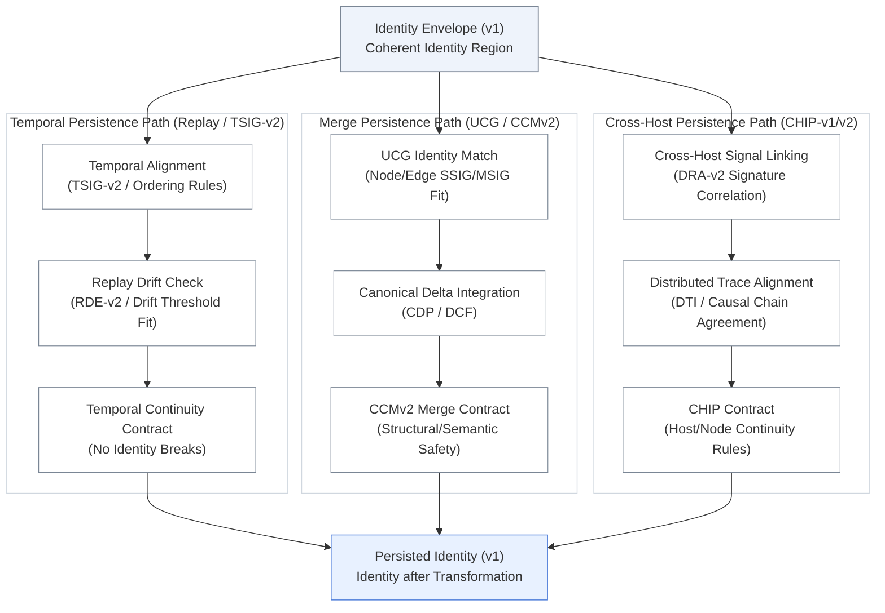

```mermaid
graph TB

%% ===========================
%% White Theme Styles
%% ===========================
classDef cluster fill:#ffffff,stroke:#d0d7df,stroke-width:1px;
classDef core fill:#eef3fb,stroke:#7a8695,stroke-width:1.2px;
classDef node fill:#ffffff,stroke:#7a8695,stroke-width:0.8px;
classDef io fill:#e8f1ff,stroke:#4b7bd9,stroke-width:1px;

%% ===========================
%% CIM-v1 Identity Envelope (Start)
%% ===========================
ID_ENV["Identity Envelope (v1)<br/>Coherent Identity Region"]
class ID_ENV core;

%% ===========================
%% Three Transformation Pathways
%% ===========================

%% ----- 1) Replay / Temporal Continuity -----
subgraph P_TEMP["Temporal Persistence Path (Replay / TSIG-v2)"]
direction TB

TP_ALIGN["Temporal Alignment<br/>(TSIG-v2 / Ordering Rules)"]
TP_DRIFT["Replay Drift Check<br/>(RDE-v2 / Drift Threshold Fit)"]
TP_CONT["Temporal Continuity Contract<br/>(No Identity Breaks)"]

class TP_ALIGN,TP_DRIFT,TP_CONT node;
end
class P_TEMP cluster;

%% ----- 2) Merge / Structural-Semantic Path -----
subgraph P_MERGE["Merge Persistence Path (UCG / CCMv2)"]
direction TB

MG_MATCH["UCG Identity Match<br/>(Node/Edge SSIG/MSIG Fit)"]
MG_DELTA["Canonical Delta Integration<br/>(CDP / DCF)"]
MG_CCM["CCMv2 Merge Contract<br/>(Structural/Semantic Safety)"]

class MG_MATCH,MG_DELTA,MG_CCM node;
end
class P_MERGE cluster;

%% ----- 3) Cross-Host / Distributed Path -----
subgraph P_DIST["Cross-Host Persistence Path (CHIP-v1/v2)"]
direction TB

CH_SIG["Cross-Host Signal Linking<br/>(DRA-v2 Signature Correlation)"]
CH_TRACE["Distributed Trace Alignment<br/>(DTI / Causal Chain Agreement)"]
CH_CONS["CHIP Contract<br/>(Host/Node Continuity Rules)"]

class CH_SIG,CH_TRACE,CH_CONS node;
end
class P_DIST cluster;

%% ===========================
%% Wiring: Envelope → Transformations
%% ===========================
ID_ENV --> TP_ALIGN
ID_ENV --> MG_MATCH
ID_ENV --> CH_SIG

TP_ALIGN --> TP_DRIFT --> TP_CONT
MG_MATCH --> MG_DELTA --> MG_CCM
CH_SIG --> CH_TRACE --> CH_CONS

%% ===========================
%% Output: Persisted Identity
%% ===========================
ID_OUT["Persisted Identity (v1)<br/>Identity after Transformation"]
class ID_OUT io;

TP_CONT --> ID_OUT
MG_CCM --> ID_OUT
CH_CONS --> ID_OUT

```