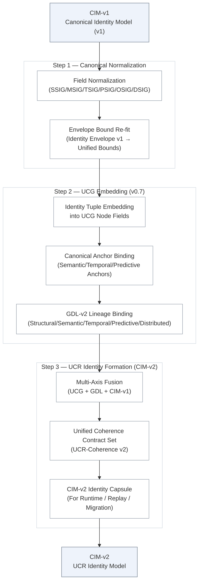

```mermaid
graph TB

%% ===========================
%% White Theme Styles
%% ===========================
classDef cluster fill:#ffffff,stroke:#d0d7df,stroke-width:1px;
classDef core fill:#eef3fb,stroke:#7a8695,stroke-width:1.2px;
classDef node fill:#ffffff,stroke:#7a8695,stroke-width:0.8px;
classDef io fill:#e8f1ff,stroke:#4b7bd9,stroke-width:1px;

%% ===========================
%% Start: CIM-v1
%% ===========================
CIM_V1["CIM-v1<br/>Canonical Identity Model (v1)"]
class CIM_V1 core;

%% ===========================
%% Step 1: Canonical Normalization
%% ===========================
subgraph S1["Step 1 — Canonical Normalization"]
direction TB

S1_FIELD["Field Normalization<br/>(SSIG/MSIG/TSIG/PSIG/OSIG/DSIG)"]
S1_BOUND["Envelope Bound Re-fit<br/>(Identity Envelope v1 → Unified Bounds)"]

class S1_FIELD,S1_BOUND node;
end
class S1 cluster;

%% ===========================
%% Step 2: UCG Embedding
%% ===========================
subgraph S2["Step 2 — UCG Embedding (v0.7)"]
direction TB

S2_MAP["Identity Tuple Embedding<br/>into UCG Node Fields"]
S2_ANCHOR["Canonical Anchor Binding<br/>(Semantic/Temporal/Predictive Anchors)"]
S2_LINEAGE["GDL-v2 Lineage Binding<br/>(Structural/Semantic/Temporal/Predictive/Distributed)"]

class S2_MAP,S2_ANCHOR,S2_LINEAGE node;
end
class S2 cluster;

%% ===========================
%% Step 3: UCR Identity Formation
%% ===========================
subgraph S3["Step 3 — UCR Identity Formation (CIM-v2)"]
direction TB

S3_FUSE["Multi-Axis Fusion<br/>(UCG + GDL + CIM-v1)"]
S3_CONTRACT["Unified Coherence Contract Set<br/>(UCR-Coherence v2)"]
S3_EMIT["CIM-v2 Identity Capsule<br/>(For Runtime / Replay / Migration)"]

class S3_FUSE,S3_CONTRACT,S3_EMIT node;
end
class S3 cluster;

%% ===========================
%% Final Output: CIM-v2
%% ===========================
CIM_V2["CIM-v2<br/>UCR Identity Model"]
class CIM_V2 core;

%% ===========================
%% Wiring
%% ===========================
CIM_V1 --> S1_FIELD --> S1_BOUND --> S2_MAP --> S2_ANCHOR --> S2_LINEAGE --> S3_FUSE --> S3_CONTRACT --> S3_EMIT --> CIM_V2


```