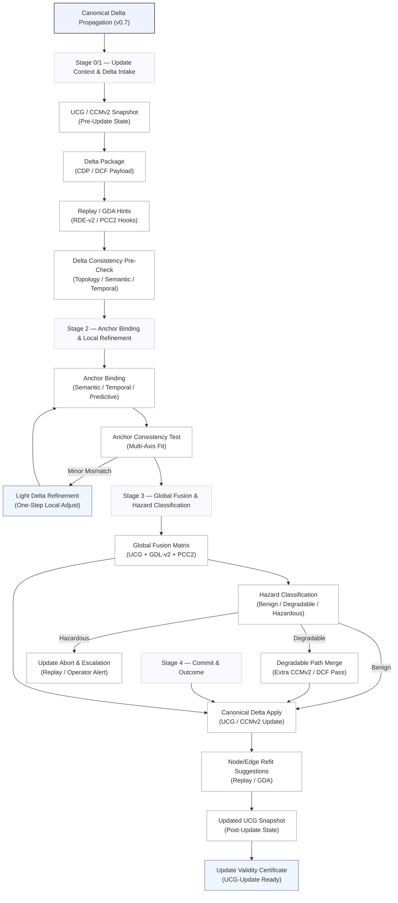

```mermaid
flowchart TB
    classDef title fill:#eef3ff,stroke:#445,stroke-width:1.5px;
    classDef cluster fill:#f9f9ff,stroke:#ccd,stroke-width:1px;
    classDef node fill:#ffffff,stroke:#999,stroke-width:1px;
    classDef highlight fill:#eef7ff,stroke:#669,stroke-width:1px;

    H3["Canonical Delta Propagation (v0.7)"]:::title

    %% Stage 0/1
    S0["Stage 0/1 — Update Context & Delta Intake"]:::cluster
    C0_1["UCG / CCMv2 Snapshot<br/>(Pre-Update State)"]:::node
    C0_2["Delta Package<br/>(CDP / DCF Payload)"]:::node
    C0_3["Replay / GDA Hints<br/>(RDE-v2 / PCC2 Hooks)"]:::node
    C0_4["Delta Consistency Pre-Check<br/>(Topology / Semantic / Temporal)"]:::node

    H3 --> S0
    S0 --> C0_1 --> C0_2 --> C0_3 --> C0_4

    %% Stage 2
    S1["Stage 2 — Anchor Binding & Local Refinement"]:::cluster
    C1_1["Anchor Binding<br/>(Semantic / Temporal / Predictive)"]:::node
    C1_2["Anchor Consistency Test<br/>(Multi-Axis Fit)"]:::node
    C1_3["Light Delta Refinement<br/>(One-Step Local Adjust)"]:::highlight

    C0_4 --> S1
    S1 --> C1_1 --> C1_2

    %% micro-loop ここを修正
    C1_2 -->|Minor Mismatch| C1_3
    C1_3 --> C1_1

    %% Stage 3
    S2["Stage 3 — Global Fusion & Hazard Classification"]:::cluster
    C2_1["Global Fusion Matrix<br/>(UCG + GDL-v2 + PCC2)"]:::node
    C2_2["Hazard Classification<br/>(Benign / Degradable / Hazardous)"]:::node
    C2_3["Degradable Path Merge<br/>(Extra CCMv2 / DCF Pass)"]:::node
    C2_4["Update Abort & Escalation<br/>(Replay / Operator Alert)"]:::node

    C1_2 --> S2
    S2 --> C2_1 --> C2_2

    %% 3分岐
    C2_2 -->|Benign| C3_1
    C2_2 -->|Degradable| C2_3
    C2_2 -->|Hazardous| C2_4

    C2_3 --> C3_1

    %% Stage 4
    S3["Stage 4 — Commit & Outcome"]:::cluster
    C3_1["Canonical Delta Apply<br/>(UCG / CCMv2 Update)"]:::node
    C3_2["Node/Edge Refit Suggestions<br/>(Replay / GDA)"]:::node
    C3_3["Updated UCG Snapshot<br/>(Post-Update State)"]:::node
    C3_4["Update Validity Certificate<br/>(UCG-Update Ready)"]:::highlight

    S3 --> C3_1 --> C3_2 --> C3_3 --> C3_4

    C2_1 --> C3_1


```