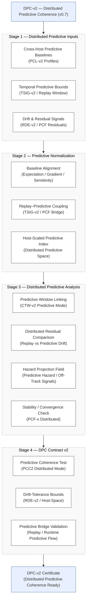

```mermaid
flowchart TB

%% ============================
%% Styles
%% ============================
classDef header fill:#e8f0ff,stroke:#4a6fa5,stroke-width:1px;
classDef cluster fill:#f9f9f9,stroke:#999,stroke-dasharray:3 3,color:#000;
classDef node fill:#ffffff,stroke:#555,stroke-width:1px;
classDef out fill:#e8f0ff,stroke:#4a6fa5,stroke-width:1px;

%% ============================
%% Header
%% ============================
DPC["DPC-v2 — Distributed Predictive Coherence (v0.7)"]:::header

%% ============================
%% Stage 1 — Distributed Predictive Inputs
%% ============================
subgraph C1["Stage 1 — Distributed Predictive Inputs"]
    PI1["Cross-Host Predictive Baselines<br/>(PCL-v2 Profiles)"]:::node
    PI2["Temporal Predictive Bounds<br/>(TSIG-v2 / Replay Window)"]:::node
    PI3["Drift & Residual Signals<br/>(RDE-v2 / PCF Residuals)"]:::node
end
class C1 cluster;

%% ============================
%% Stage 2 — Predictive Normalization
%% ============================
subgraph C2["Stage 2 — Predictive Normalization"]
    PN1["Baseline Alignment<br/>(Expectation / Gradient / Sensitivity)"]:::node
    PN2["Replay–Predictive Coupling<br/>(TSIG-v2 / PCF Bridge)"]:::node
    PN3["Host-Scaled Predictive Index<br/>(Distributed Predictive Space)"]:::node
end
class C2 cluster;

%% ============================
%% Stage 3 — Distributed Predictive Analysis
%% ============================
subgraph C3["Stage 3 — Distributed Predictive Analysis"]
    PA1["Predictive Window Linking<br/>(CTW-v2 Predictive Mode)"]:::node
    PA2["Distributed Residual Comparison<br/>(Replay vs Predictive Drift)"]:::node
    PA3["Hazard Projection Field<br/>(Predictive Hazard / Off-Track Signals)"]:::node
    PA4["Stability / Convergence Check<br/>(PCF-x Distributed)"]:::node
end
class C3 cluster;

%% ============================
%% Stage 4 — DPC Contract v2
%% ============================
subgraph C4["Stage 4 — DPC Contract v2"]
    DC1["Predictive Coherence Test<br/>(PCC2 Distributed Mode)"]:::node
    DC2["Drift-Tolerance Bounds<br/>(RDE-v2 / Host-Space)"]:::node
    DC3["Predictive Bridge Validation<br/>(Replay / Runtime Predictive Flow)"]:::node
end
class C4 cluster;

%% ============================
%% Output
%% ============================
CERT["DPC-v2 Certificate<br/>(Distributed Predictive Coherence Ready)"]:::out

%% ============================
%% Flow
%% ============================
DPC --> C1
C1 --> C2
C2 --> C3
C3 --> C4
C4 --> CERT

```