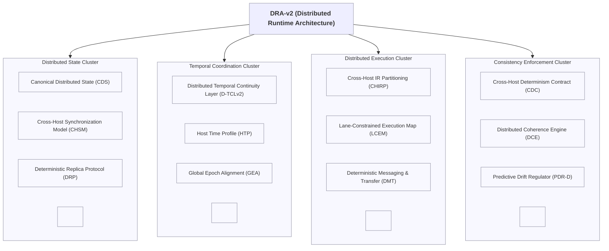

```mermaid
flowchart TB

    %% ============================
    %%  Class Definitions
    %% ============================
    classDef title fill:#eef,stroke:#99a,stroke-width:1px,font-size:16px,font-weight:bold;
    classDef box fill:#f8f8ff,stroke:#99a,stroke-width:1px,font-size:13px;


    %% ============================
    %%  Layer Title
    %% ============================
    DRATitle["DRA-v2 (Distributed Runtime Architecture)"]
    class DRATitle title


    %% ============================
    %%  Clusters
    %% ============================

    %% --- 1. Distributed State Cluster ---
    subgraph D1["Distributed State Cluster"]
        D1n1["Canonical Distributed State (CDS)"]
        D1n2["Cross-Host Synchronization Model (CHSM)"]
        D1n3["Deterministic Replica Protocol (DRP)"]
        D1n4["&nbsp;"]
    end

    %% --- 2. Temporal Coordination Cluster ---
    subgraph D2["Temporal Coordination Cluster"]
        D2n1["Distributed Temporal Continuity Layer (D-TCLv2)"]
        D2n2["Host Time Profile (HTP)"]
        D2n3["Global Epoch Alignment (GEA)"]
        D2n4["&nbsp;"]
    end

    %% --- 3. Distributed Execution Cluster ---
    subgraph D3["Distributed Execution Cluster"]
        D3n1["Cross-Host IR Partitioning (CHIRP)"]
        D3n2["Lane-Constrained Execution Map (LCEM)"]
        D3n3["Deterministic Messaging & Transfer (DMT)"]
        D3n4["&nbsp;"]
    end

    %% --- 4. Consistency Enforcement Cluster ---
    subgraph D4["Consistency Enforcement Cluster"]
        D4n1["Cross-Host Determinism Contract (CDC)"]
        D4n2["Distributed Coherence Engine (DCE)"]
        D4n3["Predictive Drift Regulator (PDR-D)"]
        D4n4["&nbsp;"]
    end


    %% ============================
    %%  Layout
    %% ============================
    DRATitle --> D1
    DRATitle --> D2
    DRATitle --> D3
    DRATitle --> D4

    class D1,D1n1,D1n2,D1n3,D1n4 box
    class D2,D2n1,D2n2,D2n3,D2n4 box
    class D3,D3n1,D3n2,D3n3,D3n4 box
    class D4,D4n1,D4n2,D4n3,D4n4 box

```