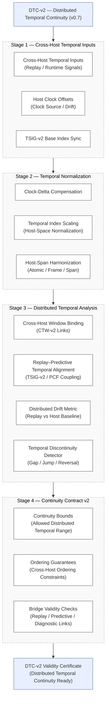

```mermaid
flowchart TB

%% ============================
%% Styles
%% ============================
classDef header fill:#e8f0ff,stroke:#4a6fa5,stroke-width:1px;
classDef cluster fill:#f9f9f9,stroke:#999,stroke-dasharray:3 3,color:#000;
classDef node fill:#ffffff,stroke:#555,stroke-width:1px;
classDef out fill:#e8f0ff,stroke:#4a6fa5,stroke-width:1px;

%% ============================
%% Header
%% ============================
DTC["DTC-v2 — Distributed Temporal Continuity (v0.7)"]:::header

%% ============================
%% Cluster 1 — Cross-Host Temporal Inputs
%% ============================
subgraph C1["Stage 1 — Cross-Host Temporal Inputs"]
    DI1["Cross-Host Temporal Inputs<br/>(Replay / Runtime Signals)"]:::node
    DI2["Host Clock Offsets<br/>(Clock Source / Drift)"]:::node
    DI3["TSIG-v2 Base Index Sync"]:::node
end
class C1 cluster;

%% ============================
%% Cluster 2 — Temporal Normalization
%% ============================
subgraph C2["Stage 2 — Temporal Normalization"]
    DN1["Clock-Delta Compensation"]:::node
    DN2["Temporal Index Scaling<br/>(Host-Space Normalization)"]:::node
    DN3["Host-Span Harmonization<br/>(Atomic / Frame / Span)"]:::node
end
class C2 cluster;

%% ============================
%% Cluster 3 — Distributed Temporal Analysis
%% ============================
subgraph C3["Stage 3 — Distributed Temporal Analysis"]
    DL1["Cross-Host Window Binding<br/>(CTW-v2 Links)"]:::node
    DL2["Replay–Predictive Temporal Alignment<br/>(TSIG-v2 / PCF Coupling)"]:::node
    DL3["Distributed Drift Metric<br/>(Replay vs Host Baseline)"]:::node
    DL4["Temporal Discontinuity Detector<br/>(Gap / Jump / Reversal)"]:::node
end
class C3 cluster;

%% ============================
%% Cluster 4 — Continuity Contract v2
%% ============================
subgraph C4["Stage 4 — Continuity Contract v2"]
    DC1["Continuity Bounds<br/>(Allowed Distributed Temporal Range)"]:::node
    DC2["Ordering Guarantees<br/>(Cross-Host Ordering Constraints)"]:::node
    DC3["Bridge Validity Checks<br/>(Replay / Predictive / Diagnostic Links)"]:::node
end
class C4 cluster;

%% ============================
%% Output Certificate
%% ============================
CERT["DTC-v2 Validity Certificate<br/>(Distributed Temporal Continuity Ready)"]:::out

%% ============================
%% Flows
%% ============================
DTC --> C1
C1 --> C2
C2 --> C3
C3 --> C4
C4 --> CERT


```