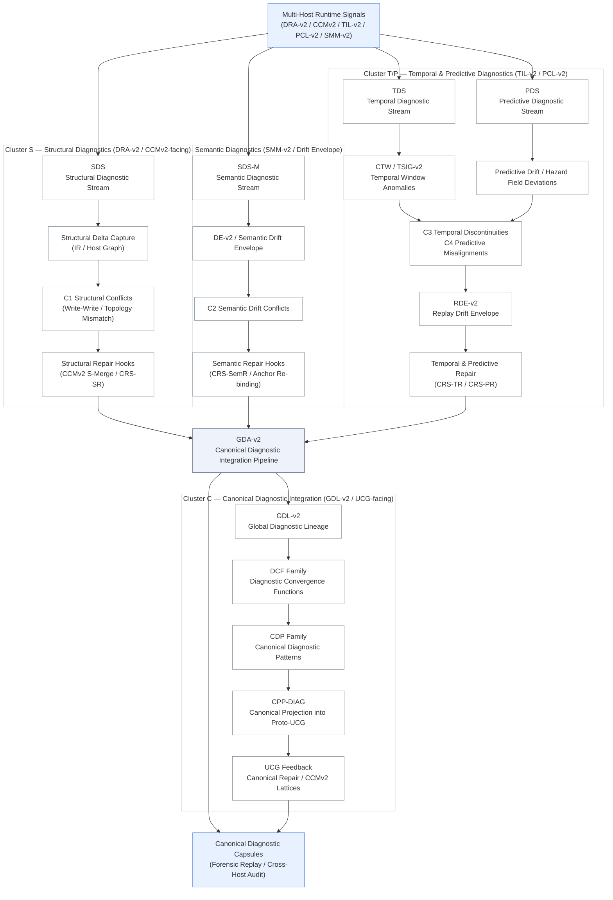

```mermaid
graph TB

%% ===========================
%% White Theme Appearance
%% ===========================
classDef cluster fill:#ffffff,stroke:#d0d7df,stroke-width:1px;
classDef core fill:#eef3fb,stroke:#7a8695,stroke-width:1.5px;
classDef node fill:#ffffff,stroke:#7a8695,stroke-width:0.8px;
classDef io fill:#e8f1ff,stroke:#4b7bd9,stroke-width:1px;

%% ===========================
%% GDA CORE
%% ===========================
GDA_CORE["GDA-v2<br/>Canonical Diagnostic Integration Pipeline"]
class GDA_CORE core;

%% ===========================
%% Cluster S — Structural
%% ===========================
subgraph C_STRUCT["Cluster S — Structural Diagnostics (DRA-v2 / CCMv2-facing)"]
direction TB

SD_INGEST["SDS<br/>Structural Diagnostic Stream"]
SD_DELTA["Structural Delta Capture<br/>(IR / Host Graph)"]
SD_CONFLICT["C1 Structural Conflicts<br/>(Write-Write / Topology Mismatch)"]
SD_REPAIR["Structural Repair Hooks<br/>(CCMv2 S-Merge / CRS-SR)"]

class SD_INGEST,SD_DELTA,SD_CONFLICT,SD_REPAIR node;
end
class C_STRUCT cluster;

%% ===========================
%% Cluster M — Semantic
%% ===========================
subgraph C_SEM["Cluster M — Semantic Diagnostics (SMM-v2 / Drift Envelope)"]
direction TB

SEM_INGEST["SDS-M<br/>Semantic Diagnostic Stream"]
SEM_DRIFT["DE-v2 / Semantic Drift Envelope"]
SEM_CONFLICT["C2 Semantic Drift Conflicts"]
SEM_REPAIR["Semantic Repair Hooks<br/>(CRS-SemR / Anchor Re-binding)"]

class SEM_INGEST,SEM_DRIFT,SEM_CONFLICT,SEM_REPAIR node;
end
class C_SEM cluster;

%% ===========================
%% Cluster T/P — Temporal & Predictive
%% ===========================
subgraph C_TIME_PRED["Cluster T/P — Temporal & Predictive Diagnostics (TIL-v2 / PCL-v2)"]
direction TB

T_INGEST["TDS<br/>Temporal Diagnostic Stream"]
T_WINDOW["CTW / TSIG-v2<br/>Temporal Window Anomalies"]
P_INGEST["PDS<br/>Predictive Diagnostic Stream"]
P_DRIFT["Predictive Drift / Hazard Field Deviations"]
TP_CONFLICT["C3 Temporal Discontinuities<br/>C4 Predictive Misalignments"]
RDE["RDE-v2<br/>Replay Drift Envelope"]
TP_REPAIR["Temporal & Predictive Repair<br/>(CRS-TR / CRS-PR)"]

class T_INGEST,T_WINDOW,P_INGEST,P_DRIFT,TP_CONFLICT,RDE,TP_REPAIR node;
end
class C_TIME_PRED cluster;

%% ===========================
%% Cluster C — Canonical Integration
%% ===========================
subgraph C_CANONICAL["Cluster C — Canonical Diagnostic Integration (GDL-v2 / UCG-facing)"]
direction TB

GDL["GDL-v2<br/>Global Diagnostic Lineage"]
DCF["DCF Family<br/>Diagnostic Convergence Functions"]
CDP["CDP Family<br/>Canonical Diagnostic Patterns"]
CPP_PROJ["CPP-DIAG<br/>Canonical Projection into Proto-UCG"]
UCG_FEEDBACK["UCG Feedback<br/>Canonical Repair / CCMv2 Lattices"]

class GDL,DCF,CDP,CPP_PROJ,UCG_FEEDBACK node;
end
class C_CANONICAL cluster;

%% ===========================
%% Runtime I/O
%% ===========================
RUNTIME_INPUT["Multi-Host Runtime Signals<br/>(DRA-v2 / CCMv2 / TIL-v2 / PCL-v2 / SMM-v2)"]
OBS_EXPORT["Canonical Diagnostic Capsules<br/>(Forensic Replay / Cross-Host Audit)"]

class RUNTIME_INPUT,OBS_EXPORT io;

%% ===========================
%% Flow Wiring
%% ===========================
RUNTIME_INPUT --> SD_INGEST
RUNTIME_INPUT --> SEM_INGEST
RUNTIME_INPUT --> T_INGEST
RUNTIME_INPUT --> P_INGEST

SD_INGEST --> SD_DELTA --> SD_CONFLICT --> SD_REPAIR --> GDA_CORE
SEM_INGEST --> SEM_DRIFT --> SEM_CONFLICT --> SEM_REPAIR --> GDA_CORE

T_INGEST --> T_WINDOW --> TP_CONFLICT
P_INGEST --> P_DRIFT --> TP_CONFLICT
TP_CONFLICT --> RDE --> TP_REPAIR --> GDA_CORE

GDA_CORE --> GDL --> DCF --> CDP --> CPP_PROJ --> UCG_FEEDBACK
GDA_CORE --> OBS_EXPORT
UCG_FEEDBACK --> OBS_EXPORT

```