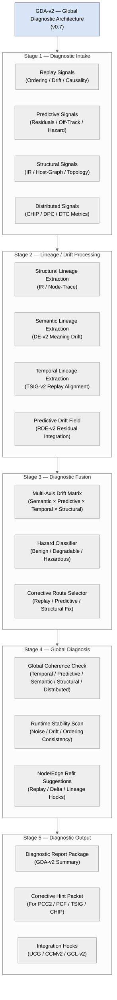

```mermaid
%%{init: {'theme':'neutral'}}%%
flowchart TB

    %% ================================
    %% Top
    %% ================================
    A["GDA-v2 — Global Diagnostic Architecture<br/>(v0.7)"]:::top

    %% ================================
    %% Stage 1 — Signal Intake
    %% ================================
    subgraph S1["Stage 1 — Diagnostic Intake"]
        SI1["Replay Signals<br/>(Ordering / Drift / Causality)"]
        SI2["Predictive Signals<br/>(Residuals / Off-Track / Hazard)"]
        SI3["Structural Signals<br/>(IR / Host-Graph / Topology)"]
        SI4["Distributed Signals<br/>(CHIP / DPC / DTC Metrics)"]
    end

    %% ================================
    %% Stage 2 — Lineage & Drift
    %% ================================
    subgraph S2["Stage 2 — Lineage / Drift Processing"]
        L1["Structural Lineage Extraction<br/>(IR / Node-Trace)"]
        L2["Semantic Lineage Extraction<br/>(DE-v2 Meaning Drift)"]
        L3["Temporal Lineage Extraction<br/>(TSIG-v2 Replay Alignment)"]
        L4["Predictive Drift Field<br/>(RDE-v2 Residual Integration)"]
    end

    %% ================================
    %% Stage 3 — Diagnostic Fusion
    %% ================================
    subgraph S3["Stage 3 — Diagnostic Fusion"]
        F1["Multi-Axis Drift Matrix<br/>(Semantic × Predictive × Temporal × Structural)"]
        F2["Hazard Classifier<br/>(Benign / Degradable / Hazardous)"]
        F3["Corrective Route Selector<br/>(Replay / Predictive / Structural Fix)"]
    end

    %% ================================
    %% Stage 4 — Global Diagnosis
    %% ================================
    subgraph S4["Stage 4 — Global Diagnosis"]
        G1["Global Coherence Check<br/>(Temporal / Predictive / Semantic / Structural / Distributed)"]
        G2["Runtime Stability Scan<br/>(Noise / Drift / Ordering Consistency)"]
        G3["Node/Edge Refit Suggestions<br/>(Replay / Delta / Lineage Hooks)"]
    end

    %% ================================
    %% Stage 5 — Output
    %% ================================
    subgraph S5["Stage 5 — Diagnostic Output"]
        O1["Diagnostic Report Package<br/>(GDA-v2 Summary)"]
        O2["Corrective Hint Packet<br/>(For PCC2 / PCF / TSIG / CHIP)"]
        O3["Integration Hooks<br/>(UCG / CCMv2 / GCL-v2)"]
    end

    %% Connections
    A --> S1
    S1 --> S2
    S2 --> S3
    S3 --> S4
    S4 --> S5

    classDef top fill:#d7e5f7,stroke:#668,stroke-width:1px;

```