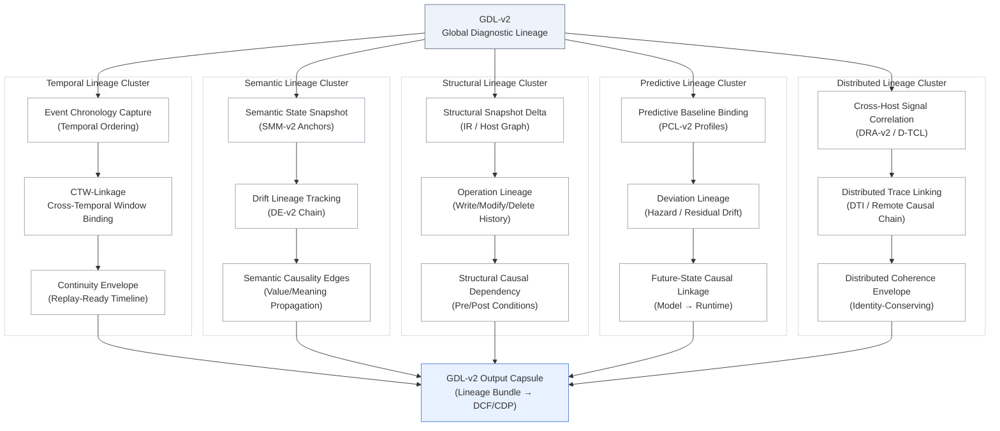

```mermaid
graph TB

%% ===========================
%% White Theme Styles
%% ===========================
classDef cluster fill:#ffffff,stroke:#d0d7df,stroke-width:1px;
classDef core fill:#eef3fb,stroke:#7a8695,stroke-width:1.2px;
classDef node fill:#ffffff,stroke:#7a8695,stroke-width:0.8px;
classDef io fill:#e8f1ff,stroke:#4b7bd9,stroke-width:1px;

%% ===========================
%% GDL-v2 Core (Top)
%% ===========================
GDL_CORE["GDL-v2<br/>Global Diagnostic Lineage"]
class GDL_CORE core;

%% ===========================
%% Cluster A — Temporal Lineage
%% ===========================
subgraph C_TEMP["Temporal Lineage Cluster"]
direction TB

TL_EVENT["Event Chronology Capture<br/>(Temporal Ordering)"]
TL_CTW["CTW-Linkage<br/>Cross-Temporal Window Binding"]
TL_CONT["Continuity Envelope<br/>(Replay-Ready Timeline)"]

class TL_EVENT,TL_CTW,TL_CONT node;
end
class C_TEMP cluster;

%% ===========================
%% Cluster B — Semantic Lineage
%% ===========================
subgraph C_SEM["Semantic Lineage Cluster"]
direction TB

SL_CAPTURE["Semantic State Snapshot<br/>(SMM-v2 Anchors)"]
SL_DRIFT["Drift Lineage Tracking<br/>(DE-v2 Chain)"]
SL_CAUSE["Semantic Causality Edges<br/>(Value/Meaning Propagation)"]

class SL_CAPTURE,SL_DRIFT,SL_CAUSE node;
end
class C_SEM cluster;

%% ===========================
%% Cluster C — Structural Lineage
%% ===========================
subgraph C_STRUCT["Structural Lineage Cluster"]
direction TB

ST_CAPTURE["Structural Snapshot Delta<br/>(IR / Host Graph)"]
ST_OP["Operation Lineage<br/>(Write/Modify/Delete History)"]
ST_CAUSE["Structural Causal Dependency<br/>(Pre/Post Conditions)"]

class ST_CAPTURE,ST_OP,ST_CAUSE node;
end
class C_STRUCT cluster;

%% ===========================
%% Cluster D — Predictive Lineage
%% ===========================
subgraph C_PRED["Predictive Lineage Cluster"]
direction TB

PL_BASE["Predictive Baseline Binding<br/>(PCL-v2 Profiles)"]
PL_DEV["Deviation Lineage<br/>(Hazard / Residual Drift)"]
PL_CAUSE["Future-State Causal Linkage<br/>(Model → Runtime)"]

class PL_BASE,PL_DEV,PL_CAUSE node;
end
class C_PRED cluster;

%% ===========================
%% Cluster E — Distributed Lineage
%% ===========================
subgraph C_DIST["Distributed Lineage Cluster"]
direction TB

DL_SIG["Cross-Host Signal Correlation<br/>(DRA-v2 / D-TCL)"]
DL_TRACE["Distributed Trace Linking<br/>(DTI / Remote Causal Chain)"]
DL_COH["Distributed Coherence Envelope<br/>(Identity-Conserving)"]

class DL_SIG,DL_TRACE,DL_COH node;
end
class C_DIST cluster;

%% ===========================
%% Wiring From GDL-v2 Core (Downward fan-out)
%% ===========================
GDL_CORE --> TL_EVENT
GDL_CORE --> SL_CAPTURE
GDL_CORE --> ST_CAPTURE
GDL_CORE --> PL_BASE
GDL_CORE --> DL_SIG

%% ===========================
%% Each Lineage Internal Wiring
%% ===========================
TL_EVENT --> TL_CTW --> TL_CONT
SL_CAPTURE --> SL_DRIFT --> SL_CAUSE
ST_CAPTURE --> ST_OP --> ST_CAUSE
PL_BASE --> PL_DEV --> PL_CAUSE
DL_SIG --> DL_TRACE --> DL_COH

%% ===========================
%% GDL-v2 Output Capsule
%% ===========================
GDL_OUT["GDL-v2 Output Capsule<br/>(Lineage Bundle → DCF/CDP)"]
class GDL_OUT io;

TL_CONT --> GDL_OUT
SL_CAUSE --> GDL_OUT
ST_CAUSE --> GDL_OUT
PL_CAUSE --> GDL_OUT
DL_COH --> GDL_OUT


```