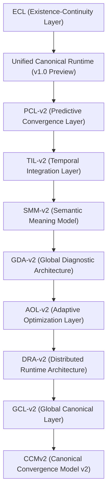

```mermaid
flowchart TD

    %% --- NEW TOP LAYER (Internal Name) ---
    subgraph ECL["ECL (Existence-Continuity Layer)"]
    end

    subgraph UCR["Unified Canonical Runtime (v1.0 Preview)"]
    end

    subgraph L7["PCL-v2 (Predictive Convergence Layer)"]
    end

    subgraph L6["TIL-v2 (Temporal Integration Layer)"]
    end

    subgraph L5["SMM-v2 (Semantic Meaning Model)"]
    end

    subgraph L4["GDA-v2 (Global Diagnostic Architecture)"]
    end

    subgraph L3["AOL-v2 (Adaptive Optimization Layer)"]
    end

    subgraph L2["DRA-v2 (Distributed Runtime Architecture)"]
    end

    subgraph L1["GCL-v2 (Global Canonical Layer)"]
    end

    subgraph L0["CCMv2 (Canonical Convergence Model v2)"]
    end

    %% --- Order of Layers ---
    ECL --> UCR
    UCR --> L7
    L7 --> L6
    L6 --> L5
    L5 --> L4
    L4 --> L3
    L3 --> L2
    L2 --> L1
    L1 --> L0

```