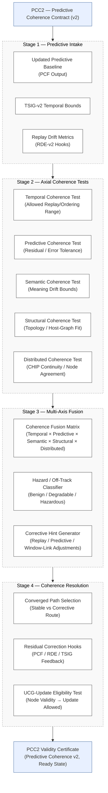

```mermaid
flowchart TB

%% ============================
%% Styles
%% ============================
classDef header fill:#e8f0ff,stroke:#4a6fa5,stroke-width:1px;
classDef cluster fill:#f9f9f9,stroke:#999,stroke-dasharray:3 3,color:#000;
classDef node fill:#ffffff,stroke:#555,stroke-width:1px;
classDef out fill:#e8f0ff,stroke:#4a6fa5,stroke-width:1px;

%% ============================
%% Header
%% ============================
PCC2["PCC2 — Predictive Coherence Contract (v2)"]:::header

%% ============================
%% Cluster 1 — Predictive Intake
%% ============================
subgraph C1["Stage 1 — Predictive Intake"]
    PI1["Updated Predictive Baseline<br/>(PCF Output)"]:::node
    PI2["TSIG-v2 Temporal Bounds"]:::node
    PI3["Replay Drift Metrics<br/>(RDE-v2 Hooks)"]:::node
end
class C1 cluster;

%% ============================
%% Cluster 2 — Axial Coherence Tests
%% ============================
subgraph C2["Stage 2 — Axial Coherence Tests"]
    AC1["Temporal Coherence Test<br/>(Allowed Replay/Ordering Range)"]:::node
    AC2["Predictive Coherence Test<br/>(Residual / Error Tolerance)"]:::node
    AC3["Semantic Coherence Test<br/>(Meaning Drift Bounds)"]:::node
    AC4["Structural Coherence Test<br/>(Topology / Host-Graph Fit)"]:::node
    AC5["Distributed Coherence Test<br/>(CHIP Continuity / Node Agreement)"]:::node
end
class C2 cluster;

%% ============================
%% Cluster 3 — Multi-Axis Fusion
%% ============================
subgraph C3["Stage 3 — Multi-Axis Fusion"]
    MF1["Coherence Fusion Matrix<br/>(Temporal × Predictive × Semantic × Structural × Distributed)"]:::node
    MF2["Hazard / Off-Track Classifier<br/>(Benign / Degradable / Hazardous)"]:::node
    MF3["Corrective Hint Generator<br/>(Replay / Predictive / Window-Link Adjustments)"]:::node
end
class C3 cluster;

%% ============================
%% Cluster 4 — Coherence Resolution
%% ============================
subgraph C4["Stage 4 — Coherence Resolution"]
    CR1["Converged Path Selection<br/>(Stable vs Corrective Route)"]:::node
    CR2["Residual Correction Hooks<br/>(PCF / RDE / TSIG Feedback)"]:::node
    CR3["UCG-Update Eligibility Test<br/>(Node Validity → Update Allowed)"]:::node
end
class C4 cluster;

%% ============================
%% Output Certificate
%% ============================
CERT["PCC2 Validity Certificate<br/>(Predictive Coherence v2, Ready State)"]:::out

%% ============================
%% Flows
%% ============================
PCC2 --> C1
C1 --> C2
C2 --> C3
C3 --> C4
C4 --> CERT


```