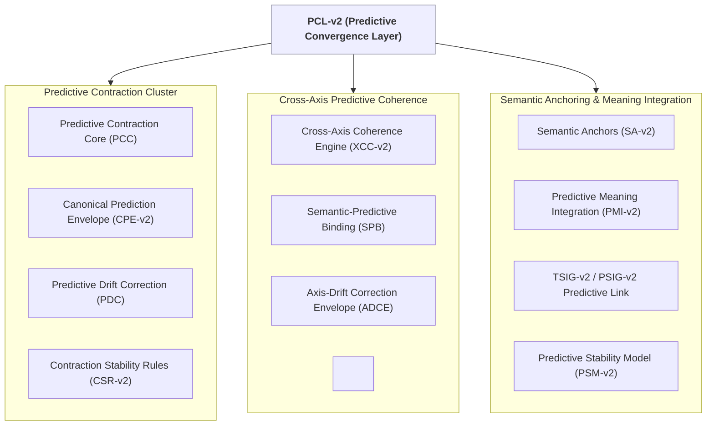

```mermaid
flowchart TB

    %% ============================
    %%  Class Definitions
    %%  （= 禁止 → 半角スペースで指定）
    %% ============================
    classDef title fill:#eef,stroke:#99a,stroke-width:1px,font-size:16px,font-weight:bold;
    classDef box fill:#f8f8ff,stroke:#99a,stroke-width:1px,font-size:13px;


    %% ============================
    %%  Layer Title
    %% ============================
    PCLTitle["PCL-v2 (Predictive Convergence Layer)"]
    class PCLTitle title


    %% ============================
    %%  Cluster Containers (名前帯だけ表示)
    %%  ※ 空ノード → NBSP (&nbsp;)
    %% ============================

    subgraph C1["Predictive Contraction Cluster"]
        C1n1["Predictive Contraction Core (PCC)"]
        C1n2["Canonical Prediction Envelope (CPE-v2)"]
        C1n3["Predictive Drift Correction (PDC)"]
        C1n4["Contraction Stability Rules (CSR-v2)"]
    end

    subgraph C2["Cross-Axis Predictive Coherence"]
        C2n1["Cross-Axis Coherence Engine (XCC-v2)"]
        C2n2["Semantic-Predictive Binding (SPB)"]
        C2n3["Axis-Drift Correction Envelope (ADCE)"]
        C2n4["&nbsp;"]
    end

    subgraph C3["Semantic Anchoring & Meaning Integration"]
        C3n1["Semantic Anchors (SA-v2)"]
        C3n2["Predictive Meaning Integration (PMI-v2)"]
        C3n3["TSIG-v2 / PSIG-v2 Predictive Link"]
        C3n4["Predictive Stability Model (PSM-v2)"]
    end


    %% ============================
    %%  Layout
    %% ============================
    PCLTitle --> C1
    PCLTitle --> C2
    PCLTitle --> C3

```