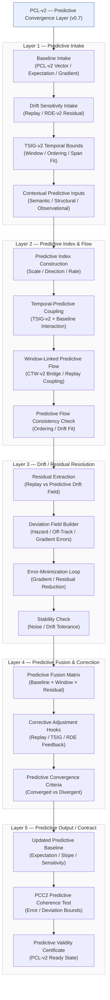

```mermaid
flowchart TB
    %% ============================================
    %% TITLE
    %% ============================================
    A0["PCL-v2 — Predictive Convergence Layer (v0.7)"]
    A0:::title

    %% ============================================
    %% LAYER 1 — Predictive Intake
    %% ============================================
    subgraph L1["Layer 1 — Predictive Intake"]
        L1_1["Baseline Intake<br/>(PCL-v2 Vector / Expectation / Gradient)"]
        L1_2["Drift Sensitivity Intake<br/>(Replay / RDE-v2 Residual)"]
        L1_3["TSIG-v2 Temporal Bounds<br/>(Window / Ordering / Span Fit)"]
        L1_4["Contextual Predictive Inputs<br/>(Semantic / Structural / Observational)"]
    end
    L1:::cluster

    %% ============================================
    %% LAYER 2 — Predictive Index & Flow
    %% ============================================
    subgraph L2["Layer 2 — Predictive Index & Flow"]
        L2_1["Predictive Index Construction<br/>(Scale / Direction / Rate)"]
        L2_2["Temporal-Predictive Coupling<br/>(TSIG-v2 × Baseline Interaction)"]
        L2_3["Window-Linked Predictive Flow<br/>(CTW-v2 Bridge / Replay Coupling)"]
        L2_4["Predictive Flow Consistency Check<br/>(Ordering / Drift Fit)"]
    end
    L2:::cluster

    %% ============================================
    %% LAYER 3 — Drift / Residual Resolution
    %% ============================================
    subgraph L3["Layer 3 — Drift / Residual Resolution"]
        L3_1["Residual Extraction<br/>(Replay vs Predictive Drift Field)"]
        L3_2["Deviation Field Builder<br/>(Hazard / Off-Track / Gradient Errors)"]
        L3_3["Error-Minimization Loop<br/>(Gradient / Residual Reduction)"]
        L3_4["Stability Check<br/>(Noise / Drift Tolerance)"]
    end
    L3:::cluster

    %% ============================================
    %% LAYER 4 — Predictive Fusion & Correction
    %% ============================================
    subgraph L4["Layer 4 — Predictive Fusion & Correction"]
        L4_1["Predictive Fusion Matrix<br/>(Baseline × Window × Residual)"]
        L4_2["Corrective Adjustment Hooks<br/>(Replay / TSIG / RDE Feedback)"]
        L4_3["Predictive Convergence Criteria<br/>(Converged vs Divergent)"]
    end
    L4:::cluster

    %% ============================================
    %% LAYER 5 — Predictive Output
    %% ============================================
    subgraph L5["Layer 5 — Predictive Output / Contract"]
        L5_1["Updated Predictive Baseline<br/>(Expectation / Slope / Sensitivity)"]
        L5_2["PCC2 Predictive Coherence Test<br/>(Error / Deviation Bounds)"]
        L5_3["Predictive Validity Certificate<br/>(PCL-v2 Ready State)"]
    end
    L5:::cluster

    %% ============================================
    %% FLOW
    %% ============================================
    A0 --> L1_1
    L1_1 --> L1_2 --> L1_3 --> L1_4 --> L2_1
    L2_1 --> L2_2 --> L2_3 --> L2_4 --> L3_1
    L3_1 --> L3_2 --> L3_3 --> L3_4 --> L4_1
    L4_1 --> L4_2 --> L4_3 --> L5_1 --> L5_2 --> L5_3

    %% ============================================
    %% STYLES
    %% ============================================
    classDef title fill:#e8f0ff,stroke:#5570aa,stroke-width:1px;
    classDef cluster fill:#fafafa,stroke:#cccccc,stroke-width:1px;


```