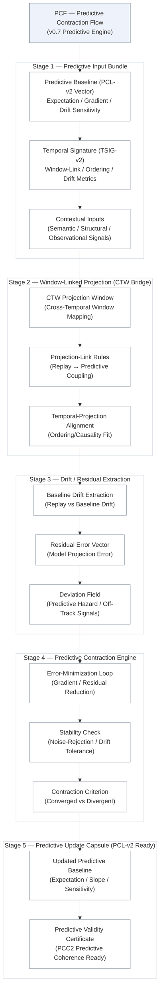

```mermaid
graph TB

%% ===========================
%% White Theme Styles
%% ===========================
classDef cluster fill:#ffffff,stroke:#d0d7df,stroke-width:1px;
classDef core fill:#eef3fb,stroke:#7a8695,stroke-width:1.2px;
classDef node fill:#ffffff,stroke:#7a8695,stroke-width:0.8px;
classDef io fill:#e8f1ff,stroke:#4b7bd9,stroke-width:1px;

%% ===========================
%% PCF (Top Node)
%% ===========================
PCF["PCF — Predictive Contraction Flow<br/>(v0.7 Predictive Engine)"]
class PCF core;

%% ===========================
%% Stage 1 — Predictive Inputs
%% ===========================
subgraph S1["Stage 1 — Predictive Input Bundle"]
direction TB

S1_BASE["Predictive Baseline (PCL-v2 Vector)<br/>Expectation / Gradient / Drift Sensitivity"]
S1_TSIG["Temporal Signature (TSIG-v2)<br/>Window-Link / Ordering / Drift Metrics"]
S1_CTX["Contextual Inputs<br/>(Semantic / Structural / Observational Signals)"]

class S1_BASE,S1_TSIG,S1_CTX node;
end
class S1 cluster;

%% ===========================
%% Stage 2 — Window-Linked Projection
%% ===========================
subgraph S2["Stage 2 — Window-Linked Projection (CTW Bridge)"]
direction TB

S2_CTW["CTW Projection Window<br/>(Cross-Temporal Window Mapping)"]
S2_LINK["Projection-Link Rules<br/>(Replay ↔ Predictive Coupling)"]
S2_ALIGN["Temporal-Projection Alignment<br/>(Ordering/Causality Fit)"]

class S2_CTW,S2_LINK,S2_ALIGN node;
end
class S2 cluster;

%% ===========================
%% Stage 3 — Predictive Residual Extraction
%% ===========================
subgraph S3["Stage 3 — Drift / Residual Extraction"]
direction TB

S3_DRIFT["Baseline Drift Extraction<br/>(Replay vs Baseline Drift)"]
S3_RESID["Residual Error Vector<br/>(Model Projection Error)"]
S3_DEV["Deviation Field<br/>(Predictive Hazard / Off-Track Signals)"]

class S3_DRIFT,S3_RESID,S3_DEV node;
end
class S3 cluster;

%% ===========================
%% Stage 4 — Contraction Engine
%% ===========================
subgraph S4["Stage 4 — Predictive Contraction Engine"]
direction TB

S4_ERR["Error-Minimization Loop<br/>(Gradient / Residual Reduction)"]
S4_STAB["Stability Check<br/>(Noise-Rejection / Drift Tolerance)"]
S4_CONTRACT["Contraction Criterion<br/>(Converged vs Divergent)"]

class S4_ERR,S4_STAB,S4_CONTRACT node;
end
class S4 cluster;

%% ===========================
%% Stage 5 — Predictive Update Capsule
%% ===========================
subgraph S5["Stage 5 — Predictive Update Capsule (PCL-v2 Ready)"]
direction TB

S5_UPD["Updated Predictive Baseline<br/>(Expectation / Slope / Sensitivity)"]
S5_CERT["Predictive Validity Certificate<br/>(PCC2 Predictive Coherence Ready)"]

class S5_UPD,S5_CERT node;
end
class S5 cluster;

%% Wiring
PCF --> S1_BASE --> S1_TSIG --> S1_CTX --> S2_CTW --> S2_LINK --> S2_ALIGN --> S3_DRIFT --> S3_RESID --> S3_DEV --> S4_ERR --> S4_STAB --> S4_CONTRACT --> S5_UPD --> S5_CERT

```