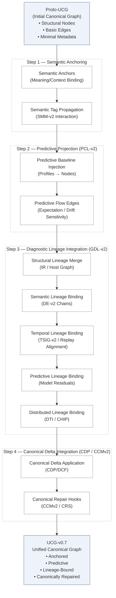

```mermaid
graph TB

%% ===========================
%% White Theme Styles
%% ===========================
classDef cluster fill:#ffffff,stroke:#d0d7df,stroke-width:1px;
classDef core fill:#eef3fb,stroke:#7a8695,stroke-width:1.2px;
classDef node fill:#ffffff,stroke:#7a8695,stroke-width:0.8px;
classDef io fill:#e8f1ff,stroke:#4b7bd9,stroke-width:1px;

%% ===========================
%% Proto-UCG (Initial Graph)
%% ===========================
PROTO["Proto-UCG<br/>(Initial Canonical Graph)<br/>• Structural Nodes<br/>• Basic Edges<br/>• Minimal Metadata"]
class PROTO core;

%% ===========================
%% Step 1 — Semantic Anchoring
%% ===========================
subgraph S1["Step 1 — Semantic Anchoring"]
direction TB

S1_SEM["Semantic Anchors<br/>(Meaning/Context Binding)"]
S1_TAG["Semantic Tag Propagation<br/>(SMM-v2 Interaction)"]

class S1_SEM,S1_TAG node;
end
class S1 cluster;

%% ===========================
%% Step 2 — Predictive Projection
%% ===========================
subgraph S2["Step 2 — Predictive Projection (PCL-v2)"]
direction TB

S2_BASE["Predictive Baseline Injection<br/>(Profiles → Nodes)"]
S2_FLOW["Predictive Flow Edges<br/>(Expectation / Drift Sensitivity)"]

class S2_BASE,S2_FLOW node;
end
class S2 cluster;

%% ===========================
%% Step 3 — Diagnostic Lineage Integration
%% ===========================
subgraph S3["Step 3 — Diagnostic Lineage Integration (GDL-v2)"]
direction TB

S3_STR["Structural Lineage Merge<br/>(IR / Host Graph)"]
S3_SEM_L["Semantic Lineage Binding<br/>(DE-v2 Chains)"]
S3_TEMP["Temporal Lineage Binding<br/>(TSIG-v2 / Replay Alignment)"]
S3_PRED["Predictive Lineage Binding<br/>(Model Residuals)"]
S3_DIST["Distributed Lineage Binding<br/>(DTI / CHIP)"]

class S3_STR,S3_SEM_L,S3_TEMP,S3_PRED,S3_DIST node;
end
class S3 cluster;

%% ===========================
%% Step 4 — Canonical Delta Integration
%% ===========================
subgraph S4["Step 4 — Canonical Delta Integration (CDP / CCMv2)"]
direction TB

S4_DELTA["Canonical Delta Application<br/>(CDP/DCF)"]
S4_REPAIR["Canonical Repair Hooks<br/>(CCMv2 / CRS)"]

class S4_DELTA,S4_REPAIR node;
end
class S4 cluster;

%% ===========================
%% Final: UCG-v0.7
%% ===========================
UCG["UCG-v0.7<br/>Unified Canonical Graph<br/>• Anchored<br/>• Predictive<br/>• Lineage-Bound<br/>• Canonically Repaired"]
class UCG core;

%% ===========================
%% Wiring
%% ===========================
PROTO --> S1_SEM --> S1_TAG --> S2_BASE --> S2_FLOW --> S3_STR --> S3_SEM_L --> S3_TEMP --> S3_PRED --> S3_DIST --> S4_DELTA --> S4_REPAIR --> UCG


```