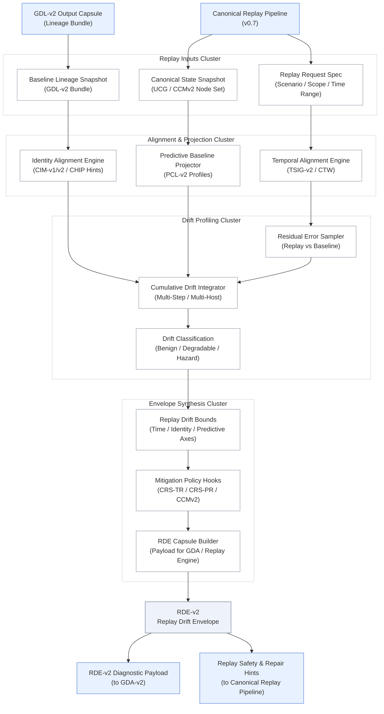

```mermaid
graph TB

%% ===========================
%% White Theme Styles
%% ===========================
classDef cluster fill:#ffffff,stroke:#d0d7df,stroke-width:1px;
classDef core fill:#eef3fb,stroke:#7a8695,stroke-width:1.2px;
classDef node fill:#ffffff,stroke:#7a8695,stroke-width:0.8px;
classDef io fill:#e8f1ff,stroke:#4b7bd9,stroke-width:1px;

%% ===========================
%% External Inputs / Outputs
%% ===========================
GDL_CAPSULE["GDL-v2 Output Capsule<br/>(Lineage Bundle)"]
CPP_PIPE["Canonical Replay Pipeline<br/>(v0.7)"]

class GDL_CAPSULE,CPP_PIPE io;

%% ===========================
%% RDE-v2 Core
%% ===========================
RDE_CORE["RDE-v2<br/>Replay Drift Envelope"]
class RDE_CORE core;

%% ===========================
%% Cluster 1 — Replay Inputs
%% ===========================
subgraph C_IN["Replay Inputs Cluster"]
direction TB

IN_REQ["Replay Request Spec<br/>(Scenario / Scope / Time Range)"]
IN_BASE["Baseline Lineage Snapshot<br/>(GDL-v2 Bundle)"]
IN_STATE["Canonical State Snapshot<br/>(UCG / CCMv2 Node Set)"]

class IN_REQ,IN_BASE,IN_STATE node;
end
class C_IN cluster;

%% ===========================
%% Cluster 2 — Alignment & Projection
%% ===========================
subgraph C_ALIGN["Alignment & Projection Cluster"]
direction TB

AL_TIME["Temporal Alignment Engine<br/>(TSIG-v2 / CTW)"]
AL_ID["Identity Alignment Engine<br/>(CIM-v1/v2 / CHIP Hints)"]
AL_PRED["Predictive Baseline Projector<br/>(PCL-v2 Profiles)"]

class AL_TIME,AL_ID,AL_PRED node;
end
class C_ALIGN cluster;

%% ===========================
%% Cluster 3 — Drift Profiling
%% ===========================
subgraph C_DRIFT["Drift Profiling Cluster"]
direction TB

DR_RESID["Residual Error Sampler<br/>(Replay vs Baseline)"]
DR_ACCUM["Cumulative Drift Integrator<br/>(Multi-Step / Multi-Host)"]
DR_CLASS["Drift Classification<br/>(Benign / Degradable / Hazard)"]

class DR_RESID,DR_ACCUM,DR_CLASS node;
end
class C_DRIFT cluster;

%% ===========================
%% Cluster 4 — Envelope Synthesis
%% ===========================
subgraph C_ENV["Envelope Synthesis Cluster"]
direction TB

ENV_BOUNDS["Replay Drift Bounds<br/>(Time / Identity / Predictive Axes)"]
ENV_POLICY["Mitigation Policy Hooks<br/>(CRS-TR / CRS-PR / CCMv2)"]
ENV_EXPORT["RDE Capsule Builder<br/>(Payload for GDA / Replay Engine)"]

class ENV_BOUNDS,ENV_POLICY,ENV_EXPORT node;
end
class C_ENV cluster;

%% ===========================
%% Wiring: Inputs → RDE → Outputs
%% ===========================

%% 外部入力 → Replay Inputs
GDL_CAPSULE --> IN_BASE
CPP_PIPE --> IN_REQ
CPP_PIPE --> IN_STATE

%% Inputs → Alignment
IN_REQ --> AL_TIME
IN_BASE --> AL_ID
IN_STATE --> AL_PRED

%% Alignment → Drift Profiling
AL_TIME --> DR_RESID
AL_ID --> DR_ACCUM
AL_PRED --> DR_ACCUM
DR_RESID --> DR_ACCUM --> DR_CLASS

%% Drift Profiling → Envelope Synthesis → RDE Core
DR_CLASS --> ENV_BOUNDS --> ENV_POLICY --> ENV_EXPORT --> RDE_CORE

%% RDE Core → 外部出力
RDE_GDA["RDE-v2 Diagnostic Payload<br/>(to GDA-v2)"]
RDE_REPLAY["Replay Safety & Repair Hints<br/>(to Canonical Replay Pipeline)"]

class RDE_GDA,RDE_REPLAY io;

RDE_CORE --> RDE_GDA
RDE_CORE --> RDE_REPLAY


```