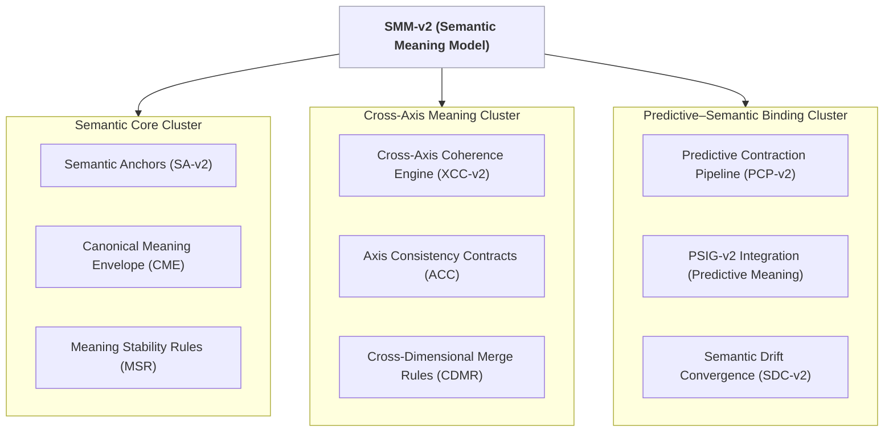

```mermaid
flowchart TB

    %% ============================
    %%  Class Definitions
    %% ============================
    classDef title fill:#eef,stroke:#99a,stroke-width:1px,font-size:16px,font-weight:bold;
    classDef box fill:#f8f8ff,stroke:#99a,stroke-width:1px,font-size:13px;


    %% ============================
    %%  Layer Title
    %% ============================
    SMMTitle["SMM-v2 (Semantic Meaning Model)"]
    class SMMTitle title


    %% ============================
    %%  Clusters
    %% ============================

    %% --- 1. Semantic Core Cluster ---
    subgraph S1["Semantic Core Cluster"]
        S1n1["Semantic Anchors (SA-v2)"]
        S1n2["Canonical Meaning Envelope (CME)"]
        S1n3["Meaning Stability Rules (MSR)"]
        %%S1n4["&nbsp;"]
    end

    %% --- 2. Cross-Axis Meaning Cluster ---
    subgraph S2["Cross-Axis Meaning Cluster"]
        S2n1["Cross-Axis Coherence Engine (XCC-v2)"]
        S2n2["Axis Consistency Contracts (ACC)"]
        S2n3["Cross-Dimensional Merge Rules (CDMR)"]
        %%S2n4["&nbsp;"]
    end

    %% --- 3. Predictive-Semantic Binding Cluster ---
    subgraph S3["Predictive–Semantic Binding Cluster"]
        S3n1["Predictive Contraction Pipeline (PCP-v2)"]
        S3n2["PSIG-v2 Integration (Predictive Meaning)"]
        S3n3["Semantic Drift Convergence (SDC-v2)"]
        %%S3n4["&nbsp;"]
    end


    %% ============================
    %%  Layout
    %% ============================
    SMMTitle --> S1
    SMMTitle --> S2
    SMMTitle --> S3

```