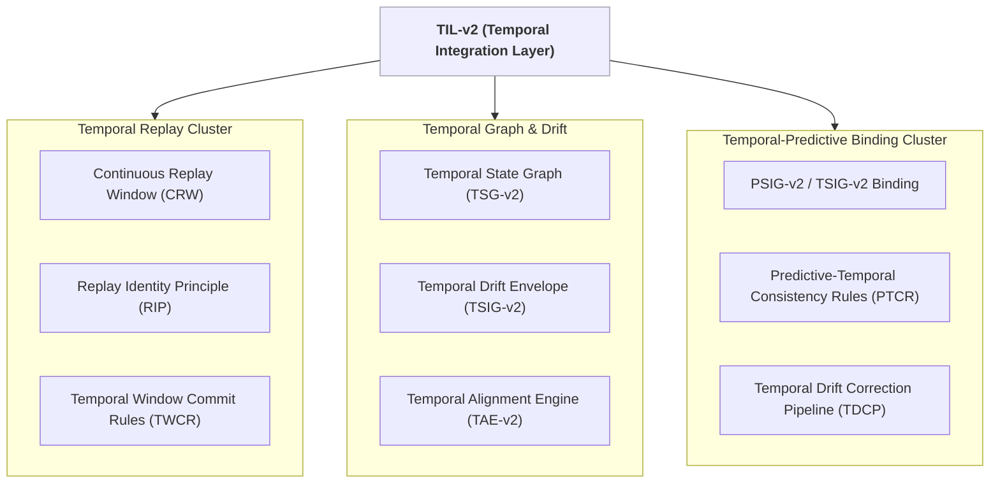

```mermaid
flowchart TB

    %% ============================
    %%  Class Definitions
    %%  （= 禁止 → コロン指定）
    %% ============================
    classDef title fill:#eef,stroke:#99a,stroke-width:1px,font-size:16px,font-weight:bold;
    classDef box fill:#f8f8ff,stroke:#99a,stroke-width:1px,font-size:13px;


    %% ============================
    %%  Layer Title
    %% ============================
    TILTitle["TIL-v2 (Temporal Integration Layer)"]
    class TILTitle title


    %% ============================
    %%  Clusters
    %% ============================

    %% --- 1. Temporal Replay Cluster ---
    subgraph T1["Temporal Replay Cluster"]
        T1n1["Continuous Replay Window (CRW)"]
        T1n2["Replay Identity Principle (RIP)"]
        T1n3["Temporal Window Commit Rules (TWCR)"]
        %%T1n4["&nbsp;"]
    end

    %% --- 2. Temporal Graph Cluster ---
    subgraph T2["Temporal Graph & Drift"]
        T2n1["Temporal State Graph (TSG-v2)"]
        T2n2["Temporal Drift Envelope (TSIG-v2)"]
        T2n3["Temporal Alignment Engine (TAE-v2)"]
        %%T2n4["&nbsp;"]
    end

    %% --- 3. Temporal-Predictive Binding ---
    subgraph T3["Temporal-Predictive Binding Cluster"]
        T3n1["PSIG-v2 / TSIG-v2 Binding"]
        T3n2["Predictive-Temporal Consistency Rules (PTCR)"]
        T3n3["Temporal Drift Correction Pipeline (TDCP)"]
        %%T3n4["&nbsp;"]
    end


    %% ============================
    %%  Layout
    %% ============================
    TILTitle --> T1
    TILTitle --> T2
    TILTitle --> T3

```