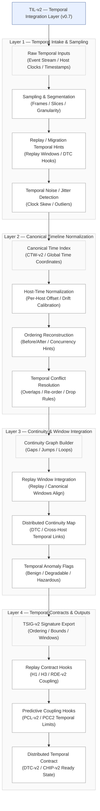

```mermaid
flowchart TB

    %% ===== Title =====
    T0["TIL-v2 — Temporal Integration Layer (v0.7)"]
    classDef title fill:#e8f0ff,stroke:#5570aa,stroke-width:1px;
    classDef cluster fill:#fafafa,stroke:#cccccc,stroke-width:1px;
    classDef node fill:#ffffff,stroke:#999999,stroke-width:1px;

    T0:::title

    %% ============================================
    %% LAYER 1 — Temporal Intake & Sampling
    %% ============================================
    subgraph L1["Layer 1 — Temporal Intake & Sampling"]
        L1_1["Raw Temporal Inputs<br/>(Event Stream / Host Clocks / Timestamps)"]:::cluster
        L1_2["Sampling & Segmentation<br/>(Frames / Slices / Granularity)"]:::node
        L1_3["Replay / Migration Temporal Hints<br/>(Replay Windows / DTC Hooks)"]:::node
        L1_4["Temporal Noise / Jitter Detection<br/>(Clock Skew / Outliers)"]:::node
    end

    %% ============================================
    %% LAYER 2 — Canonical Timeline Normalization
    %% ============================================
    subgraph L2["Layer 2 — Canonical Timeline Normalization"]
        L2_1["Canonical Time Index<br/>(CTW-v2 / Global Time Coordinates)"]:::cluster
        L2_2["Host-Time Normalization<br/>(Per-Host Offset / Drift Calibration)"]:::node
        L2_3["Ordering Reconstruction<br/>(Before/After / Concurrency Hints)"]:::node
        L2_4["Temporal Conflict Resolution<br/>(Overlaps / Re-order / Drop Rules)"]:::node
    end

    %% ============================================
    %% LAYER 3 — Continuity & Window Integration
    %% ============================================
    subgraph L3["Layer 3 — Continuity & Window Integration"]
        L3_1["Continuity Graph Builder<br/>(Gaps / Jumps / Loops)"]:::cluster
        L3_2["Replay Window Integration<br/>(Replay / Canonical Windows Align)"]:::node
        L3_3["Distributed Continuity Map<br/>(DTC / Cross-Host Temporal Links)"]:::node
        L3_4["Temporal Anomaly Flags<br/>(Benign / Degradable / Hazardous)"]:::node
    end

    %% ============================================
    %% LAYER 4 — Temporal Contracts & Outputs
    %% ============================================
    subgraph L4["Layer 4 — Temporal Contracts & Outputs"]
        L4_1["TSIG-v2 Signature Export<br/>(Ordering / Bounds / Windows)"]:::cluster
        L4_2["Replay Contract Hooks<br/>(H1 / H3 / RDE-v2 Coupling)"]:::node
        L4_3["Predictive Coupling Hooks<br/>(PCL-v2 / PCC2 Temporal Limits)"]:::node
        L4_4["Distributed Temporal Contract<br/>(DTC-v2 / CHIP-v2 Ready State)"]:::node
    end

    %% ============================================
    %% FLOW
    %% ============================================
    T0 --> L1_1
    L1_1 --> L1_2 --> L1_3 --> L1_4 --> L2_1
    L2_1 --> L2_2 --> L2_3 --> L2_4 --> L3_1
    L3_1 --> L3_2 --> L3_3 --> L3_4 --> L4_1
    L4_1 --> L4_2 --> L4_3 --> L4_4


```