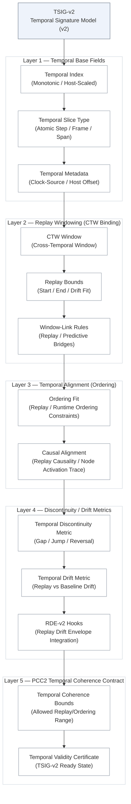

```mermaid
graph TB

%% ===========================
%% White Theme Styles
%% ===========================
classDef cluster fill:#ffffff,stroke:#d0d7df,stroke-width:1px;
classDef core fill:#eef3fb,stroke:#7a8695,stroke-width:1.2px;
classDef node fill:#ffffff,stroke:#7a8695,stroke-width:0.8px;
classDef io fill:#e8f1ff,stroke:#4b7bd9,stroke-width:1px;

%% ===========================
%% TSIG-v2 (Top Node)
%% ===========================
TSIG["TSIG-v2<br/>Temporal Signature Model (v2)"]
class TSIG core;

%% ===========================
%% Layer 1 — Temporal Base Fields
%% ===========================
subgraph L1["Layer 1 — Temporal Base Fields"]
direction TB

L1_IDX["Temporal Index<br/>(Monotonic / Host-Scaled)"]
L1_SLICE["Temporal Slice Type<br/>(Atomic Step / Frame / Span)"]
L1_META["Temporal Metadata<br/>(Clock-Source / Host Offset)"]

class L1_IDX,L1_SLICE,L1_META node;
end
class L1 cluster;

%% ===========================
%% Layer 2 — Replay Window & CTW Binding
%% ===========================
subgraph L2["Layer 2 — Replay Windowing (CTW Binding)"]
direction TB

L2_WIN["CTW Window<br/>(Cross-Temporal Window)"]
L2_BOUND["Replay Bounds<br/>(Start / End / Drift Fit)"]
L2_LINK["Window-Link Rules<br/>(Replay / Predictive Bridges)"]

class L2_WIN,L2_BOUND,L2_LINK node;
end
class L2 cluster;

%% ===========================
%% Layer 3 — Temporal Alignment Engine
%% ===========================
subgraph L3["Layer 3 — Temporal Alignment (Ordering)"]
direction TB

L3_ORDER["Ordering Fit<br/>(Replay / Runtime Ordering Constraints)"]
L3_CAUSAL["Causal Alignment<br/>(Replay Causality / Node Activation Trace)"]

class L3_ORDER,L3_CAUSAL node;
end
class L3 cluster;

%% ===========================
%% Layer 4 — Temporal Drift & Discontinuity Metrics
%% ===========================
subgraph L4["Layer 4 — Discontinuity / Drift Metrics"]
direction TB

L4_DISC["Temporal Discontinuity Metric<br/>(Gap / Jump / Reversal)"]
L4_DRIFT["Temporal Drift Metric<br/>(Replay vs Baseline Drift)"]
L4_RDE["RDE-v2 Hooks<br/>(Replay Drift Envelope Integration)"]

class L4_DISC,L4_DRIFT,L4_RDE node;
end
class L4 cluster;

%% ===========================
%% Layer 5 — Temporal Coherence Contract (PCC2)
%% ===========================
subgraph L5["Layer 5 — PCC2 Temporal Coherence Contract"]
direction TB

L5_BOUND["Temporal Coherence Bounds<br/>(Allowed Replay/Ordering Range)"]
L5_CERT["Temporal Validity Certificate<br/>(TSIG-v2 Ready State)"]

class L5_BOUND,L5_CERT node;
end
class L5 cluster;

%% Wiring
TSIG --> L1_IDX --> L1_SLICE --> L1_META --> L2_WIN --> L2_BOUND --> L2_LINK --> L3_ORDER --> L3_CAUSAL --> L4_DISC --> L4_DRIFT --> L4_RDE --> L5_BOUND --> L5_CERT


```