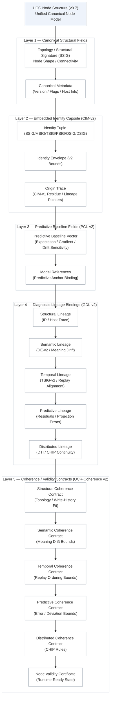

```mermaid
graph TB

%% ===========================
%% White Theme Styles
%% ===========================
classDef cluster fill:#ffffff,stroke:#d0d7df,stroke-width:1px;
classDef core fill:#eef3fb,stroke:#7a8695,stroke-width:1.2px;
classDef node fill:#ffffff,stroke:#7a8695,stroke-width:0.8px;
classDef highlight fill:#e8f1ff,stroke:#4b7bd9,stroke-width:1px;

%% ===========================
%% UCG Node (v0.7)
%% ===========================
UCG_NODE["UCG Node Structure (v0.7)<br/>Unified Canonical Node Model"]
class UCG_NODE core;

%% ===========================
%% Canonical Structural Fields
%% ===========================
subgraph S1["Layer 1 — Canonical Structural Fields"]
direction TB

S1_TOPO["Topology / Structural Signature (SSIG)<br/>Node Shape / Connectivity"]
S1_META["Canonical Metadata<br/>(Version / Flags / Host Info)"]

class S1_TOPO,S1_META node;
end
class S1 cluster;

%% ===========================
%% Embedded Identity (CIM-v2)
%% ===========================
subgraph S2["Layer 2 — Embedded Identity Capsule (CIM-v2)"]
direction TB

S2_TUPLE["Identity Tuple (SSIG/MSIG/TSIG/PSIG/OSIG/DSIG)"]
S2_ENV["Identity Envelope (v2 Bounds)"]
S2_ORIGIN["Origin Trace<br/>(CIM-v1 Residue / Lineage Pointers)"]

class S2_TUPLE,S2_ENV,S2_ORIGIN node;
end
class S2 cluster;

%% ===========================
%% Predictive Baseline (PCL-v2)
%% ===========================
subgraph S3["Layer 3 — Predictive Baseline Fields (PCL-v2)"]
direction TB

S3_BASE["Predictive Baseline Vector<br/>(Expectation / Gradient / Drift Sensitivity)"]
S3_MODEL["Model References<br/>(Predictive Anchor Binding)"]

class S3_BASE,S3_MODEL node;
end
class S3 cluster;

%% ===========================
%% Diagnostic Lineage Bindings (GDL-v2)
%% ===========================
subgraph S4["Layer 4 — Diagnostic Lineage Bindings (GDL-v2)"]
direction TB

S4_STR["Structural Lineage<br/>(IR / Host Trace)"]
S4_SEM["Semantic Lineage<br/>(DE-v2 / Meaning Drift)"]
S4_TEMP["Temporal Lineage<br/>(TSIG-v2 / Replay Alignment)"]
S4_PRED["Predictive Lineage<br/>(Residuals / Projection Errors)"]
S4_DIST["Distributed Lineage<br/>(DTI / CHIP Continuity)"]

class S4_STR,S4_SEM,S4_TEMP,S4_PRED,S4_DIST node;
end
class S4 cluster;

%% ===========================
%% Coherence & Validity Contracts
%% ===========================
subgraph S5["Layer 5 — Coherence / Validity Contracts (UCR-Coherence v2)"]
direction TB

S5_STRUCT["Structural Coherence Contract<br/>(Topology / Write-History Fit)"]
S5_SEM["Semantic Coherence Contract<br/>(Meaning Drift Bounds)"]
S5_TEMP["Temporal Coherence Contract<br/>(Replay Ordering Bounds)"]
S5_PRED["Predictive Coherence Contract<br/>(Error / Deviation Bounds)"]
S5_DIST["Distributed Coherence Contract<br/>(CHIP Rules)"]
S5_VALID["Node Validity Certificate<br/>(Runtime-Ready State)"]

class S5_STRUCT,S5_SEM,S5_TEMP,S5_PRED,S5_DIST,S5_VALID node;
end
class S5 cluster;

%% Wiring
UCG_NODE --> S1_TOPO --> S1_META --> S2_TUPLE --> S2_ENV --> S2_ORIGIN --> S3_BASE --> S3_MODEL --> S4_STR --> S4_SEM --> S4_TEMP --> S4_PRED --> S4_DIST --> S5_STRUCT --> S5_SEM --> S5_TEMP --> S5_PRED --> S5_DIST --> S5_VALID


```