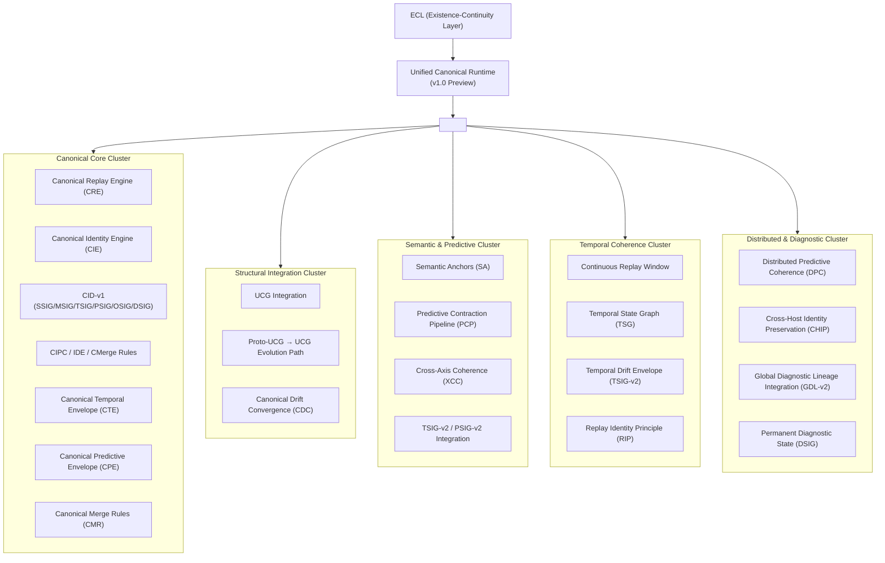

```mermaid
flowchart TB
classDef title fill:#eef stroke:#99a stroke-width:1px font-size:15px font-weight:bold;
classDef box   fill:#f8f8ff stroke:#99a stroke-width:1px font-size:13px;


    ECL["ECL (Existence-Continuity Layer)"]:::title
    UCR["Unified Canonical Runtime<br/>(v1.0 Preview)"]:::title

    %% 中継ノード（見えないように最小サイズ）
    ClusterHub[" "]:::title

    ECL --> UCR
    UCR --> ClusterHub

    %% ───────────────────────
    %% Canonical Core Cluster
    %% ───────────────────────
    subgraph CORE["Canonical Core Cluster"]
        CRE["Canonical Replay Engine (CRE)"]:::box
        CIE["Canonical Identity Engine (CIE)"]:::box
        CID["CID-v1<br/>(SSIG/MSIG/TSIG/PSIG/OSIG/DSIG)"]:::box
        CIPC["CIPC / IDE / CMerge Rules"]:::box
        CTE["Canonical Temporal Envelope (CTE)"]:::box
        CPE["Canonical Predictive Envelope (CPE)"]:::box
        CMR["Canonical Merge Rules (CMR)"]:::box
    end
    ClusterHub --> CORE

    %% ───────────────────────
    %% Structural Integration Cluster
    %% ───────────────────────
    subgraph STRUCT["Structural Integration Cluster"]
        UCG["UCG Integration"]:::box
        Proto["Proto-UCG → UCG Evolution Path"]:::box
        CDC["Canonical Drift Convergence (CDC)"]:::box
    end
    ClusterHub --> STRUCT

    %% ───────────────────────
    %% Semantic & Predictive Cluster
    %% ───────────────────────
    subgraph SEM["Semantic & Predictive Cluster"]
        SA["Semantic Anchors (SA)"]:::box
        PCP["Predictive Contraction Pipeline (PCP)"]:::box
        XCC["Cross-Axis Coherence (XCC)"]:::box
        TSIG["TSIG-v2 / PSIG-v2 Integration"]:::box
    end
    ClusterHub --> SEM

    %% ───────────────────────
    %% Temporal Coherence Cluster
    %% ───────────────────────
    subgraph TEMP["Temporal Coherence Cluster"]
        CRW["Continuous Replay Window"]:::box
        TSG["Temporal State Graph (TSG)"]:::box
        TDE["Temporal Drift Envelope (TSIG-v2)"]:::box
        RIP["Replay Identity Principle (RIP)"]:::box
    end
    ClusterHub --> TEMP

    %% ───────────────────────
    %% Distributed & Diagnostic Cluster
    %% ───────────────────────
    subgraph DIST["Distributed & Diagnostic Cluster"]
        DPC["Distributed Predictive Coherence (DPC)"]:::box
        CHIP["Cross-Host Identity Preservation (CHIP)"]:::box
        GDL["Global Diagnostic Lineage Integration (GDL-v2)"]:::box
        DSIG2["Permanent Diagnostic State (DSIG)"]:::box
    end
    ClusterHub --> DIST

```